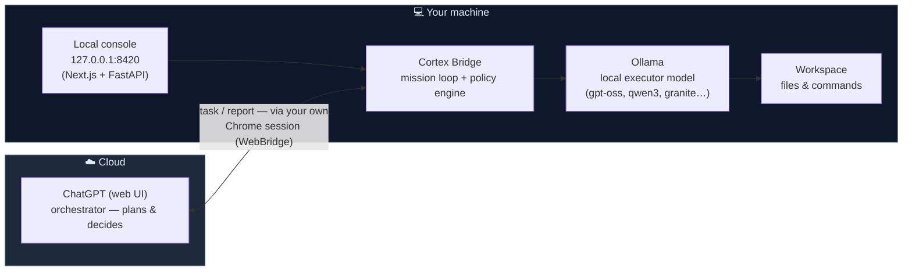

# Cortex Bridge 🌉🧠

**A cloud brain. Local hands. One conversation loop.**

Cortex Bridge connects a powerful cloud LLM orchestrator (ChatGPT, Claude, any
strong planner) to a **local agentic executor** running on your own machine via
Ollama. The orchestrator thinks and plans; the local model executes code,
touches your filesystem, runs commands — then reports back into the
conversation so the loop continues.



## Why?

- **Local execution is free and private** — no API cost per action, your code
  never leaves your disk.
- **Cloud planning is strong** — frontier models are better at decomposition,
  review and long-horizon reasoning than anything that fits in 16 GB of RAM.
- **Each model does what it's best at.**

## Project status

✅ **Working end-to-end.** Autonomous missions verified against the real
chatgpt.com web UI on 2026-07-24:

- ✅ Local executor stack: Ollama models + policy engine + tool executor
  (`executor/`)
- ✅ Mission loop: contract → decision → tool execution → report → next
  decision, all inside a single ChatGPT conversation (`orchestration/`)
- ✅ ChatGPT Web Transport through the user's own Chrome via WebBridge
  (`transport/chatgpt_web/`) — DOM-only, no OpenAI API key needed
- ✅ Local web console (FastAPI) to launch, watch, approve, pause and stop
  missions (`console/`) — loopback only, French UI
- ✅ Live ChatGPT chat from the console: per-conversation statuses
  (ChatGPT + Agent), pinned/project conversation types with counters
  (50 max), explicit send states, SPA conversation switching in
  ~0.9–3.2 s without page reload
- ✅ Attachments: send files and images to ChatGPT, or a screenshot of the
  conversation tab — with explicit limits (512 MB per file, 20 MB per
  image) and French error messages; a two-conversation write guard keeps
  drafts safe (409 with a clear message)
- ✅ Verified live: read-only missions, file writes with human approval,
  multi-iteration code repair, policy refusals, emergency stop,
  screenshot round-trip (ChatGPT acknowledged receipt)
- ⚠️ The web transport automates a consumer product UI and may break when
  ChatGPT changes its frontend — read
  [docs/legal-notes.md](docs/legal-notes.md) and
  [docs/chatgpt-web-transport.md](docs/chatgpt-web-transport.md)

See [docs/testing.md](docs/testing.md) for the full verification matrix.

## Repository layout

```
cortex-bridge/
├── docs/            Architecture, security model, transport, testing — read these first
├── executor/        The local half: policy engine + tool executor (paths, processes)
├── orchestration/   The loop: state machine, cortex.v1 protocol, runner, SQLite store
├── transport/       ChatGPT Web Transport (WebBridge driver + local fixture)
├── console/         Local web cockpit: launch/watch/approve/stop missions
└── examples/        What a full loop looks like
```

## Quick start (missions)

Requirements: macOS, [Ollama](https://ollama.com) with the executor models,
Chrome with the WebBridge extension connected to your ChatGPT session.

```bash
./scripts/start-local.sh   # serves the console at http://127.0.0.1:8420
```

The console is a local web cockpit (Next.js UI + FastAPI, loopback only):

1. Read the experimental-transport warning and opt in (persisted once).
2. Pick a mode: **Message simple** (one-shot chat through ChatGPT) or
   **Mission autonome** (the full plan → execute → report loop). Paste an
   objective, pick a workspace, choose a new or existing ChatGPT conversation
   from the sidebar, launch.
3. Watch decisions, tool executions and reports stream in; approve writes
   when prompted; STOP EVERYTHING kills everything instantly. Settings also
   expose the ChatGPT model switcher (experimental).

To hack on the UI: `scripts/dev-ui.sh` (Next.js dev server) and
`scripts/build-ui.sh` (static export served by the console).

The executor never leaves the workspace, never installs packages, and every
write can require your explicit approval. Details:
[docs/security-model.md](docs/security-model.md).

**Prefer to build it by hand, step by step?** →
[docs/manual-setup.md](docs/manual-setup.md) explains every command and every
config line — no scripts required.

## Contributing

Cortex Bridge is community-driven — ideas, issues and PRs are all welcome.

- 💡 **Suggest an improvement** → open a
  [feature request](https://github.com/Jonassuhard/cortex-bridge/issues/new?template=feature_request.md)
  (labelled `enhancement`, browsable
  [here](https://github.com/Jonassuhard/cortex-bridge/labels/enhancement) —
  vote with 👍 to prioritize)
- 🐛 **Report a bug** → use the
  [bug report template](https://github.com/Jonassuhard/cortex-bridge/issues/new?template=bug_report.md)
- 💬 **Discuss** → [GitHub Discussions](https://github.com/Jonassuhard/cortex-bridge/discussions)
  for questions, ideas and show-and-tell
- 🔧 **Submit code** → read [CONTRIBUTING.md](CONTRIBUTING.md) first; the
  test suite (`python3 -m unittest discover -s tests`) must stay green

## License

MIT — see [LICENSE](LICENSE).
