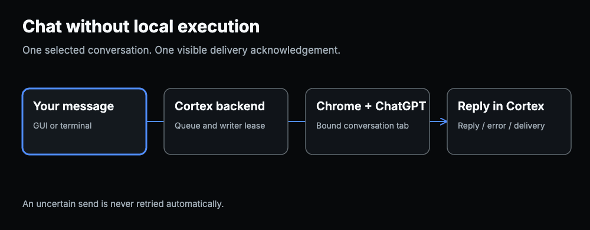
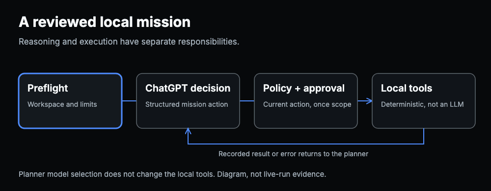
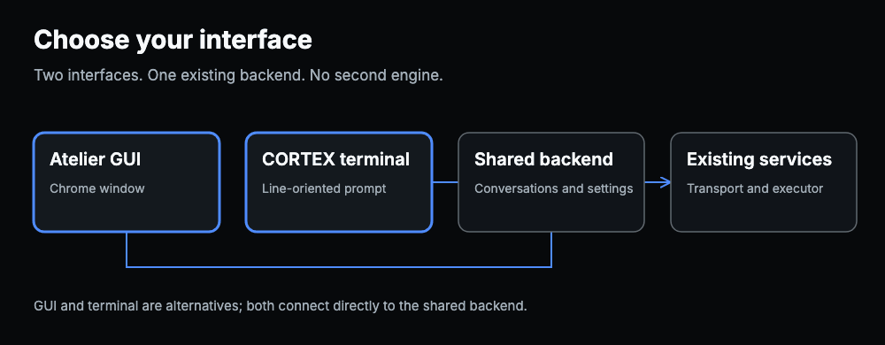

# Cortex Bridge

[](LICENSE)
[](CHANGELOG.md)

Use a ChatGPT web conversation as the reasoning side of a local, reviewed
execution workflow. Choose the Atelier graphical interface or the optional
CORTEX terminal. Both use the same local backend; neither adds a second engine.

**Status: 0.6.1 technical-preview candidate, not a provider-authorized or
verified live release.** The full-screen terminal smoke/CLI slice passes 81
tests; the complete backend suite passes 724 tests. The frontend passes 207
unit tests plus 36 runtime/privacy contracts, typecheck, lint and a static
build. Browser fixtures pass 26 E2E tests (one optional guide test skipped) and
4 accessibility checks. The release evidence manifest records the remaining
provider-terms and clean-install boundaries; see [current evidence](docs/verification-v061.md).
Earlier release evidence does not validate this candidate.

Created by [Jonas Suhard](https://github.com/Jonassuhard).
MIT-licensed, independent and not affiliated with OpenAI.

## Three ways to use it

| Use case | What happens | What does not happen |
| --- | --- | --- |
| Chat | Select a conversation, send text, read the reply | A chat does not implicitly authorize local execution |
| Reviewed mission | Confirm workspace and policy, review pending actions, inspect recorded results | No automatic broad write approval |
| Terminal or Atelier | Use the optional terminal or the web UI against one backend | No separate queue, model subscription or execution service |


[Static version](docs/media/chat-flow.svg)


[Static version](docs/media/mission-flow.svg)


[Static version](docs/media/interfaces-flow.svg)

[Interactive diagrams and their limits](docs/use-cases.html)

## What is included in this candidate

- Atelier conversation layout, collapsible diagnostics and clearer task states.
- Geometric project card, action icons and reduced-motion behavior.
- Optional French full-screen terminal with a CORTEX header, side-by-side
  ChatGPT/executor status, conversation history, replies, delivery acknowledgement
  and explicit controls. `--plain` keeps the line-oriented fallback for small or
  incompatible terminals.
- Up to 50 listed conversations; the backend enforces two active writing leases.
- No automatic resend when delivery is uncertain.
- In-memory terminal drafts, isolated by submission and conversation.
- Once-only terminal approvals bound to the backend's pending action identity.
- Chrome-extension transport; no OpenAI API key on this transport path.
- A deterministic local executor; Ollama remains optional.

### Which model does what?

| Layer | Current mission behavior | Selection means |
| --- | --- | --- |
| ChatGPT planner | Produces structured actions in the linked web conversation | `/modele` selects a discovered ChatGPT model, not a local executor |
| Local mission executor | Runs policy-approved tools deterministically | No executor LLM is selected on this mission path |
| Ollama | Separate legacy task path and diagnostics | Its availability does not prove a mission used it |
| Freebuff | Optional external installation/testing assistant | Not an integrated mission executor |

Changing an executor setting does not change the deterministic mission engine.
Do not interpret the decorative Luna/Terra/Sol/Astra project card as a list of
connected executors. A model comparison requires recorded model identity for
each actual run, not just a selected label.

The full-screen terminal is a client of the same local API, not a second engine.
Drafts do not survive terminal exit. Browser and file-upload support remain
subject to the existing platform and transport limits.

## Start from an existing checkout

```sh
scripts/cortex --help
scripts/cortex --version
scripts/cortex
scripts/cortex --plain
scripts/cortex ui
```

The source wrapper uses the existing Python environment. It does not install a
global command or alter PATH. The default is the full-screen TUI; `--plain` is
the explicit line-oriented fallback. Inside the fallback, use `/aide`,
`/conversations`, `/ouvrir 1`, `/historique`, `/suivre` and `/quitter`.
`/demarrer` delegates to the managed checkout launcher; it is not an installer.

Read the [terminal guide](docs/TERMINAL.md) for connection, missions, approval
and error behavior.

## Installation

Target: macOS with [Google Chrome](https://www.google.com/chrome/),
[Python 3.11+](https://www.python.org/downloads/macos/) and
[Git](https://git-scm.com/download/mac). Native Windows installation has not
been validated for this candidate.

Inspect the installer plan before approving its exact hash:

```sh
./scripts/install.sh --dry-run --json
./scripts/install.sh --approve-plan PLAN_HASH --json
./scripts/cortex.sh doctor --json
```

Load the installer-reported `chrome_extension_path` in
`chrome://extensions` using **Load unpacked**. The source directory is
`chrome-extension/`, not `extension/`. Open Cortex in that Chrome profile,
then use **Ouvrir ChatGPT**. Sign-in and browser permission prompts are human
steps. File sending additionally requires the documented macOS Accessibility
helper and permission.

- [Full installation](INSTALL.md)
- [Terminal installation](docs/installation-terminal.md)
- [Agent-assisted installation and approval](docs/agent-installation.md)
- [Optional Freebuff-assisted installation](docs/freebuff-installation.md)
- [User guide](docs/user-guide.md)
- [Troubleshooting](docs/troubleshooting.md)

## Verification and benchmarks

[Current test results and open gates](docs/verification-v061.md) separate
automated fixtures, historical observations and untested live behavior.
[Benchmark evidence](docs/benchmarks.md) reports stored executor experiments
with their small sample sizes and limitations.

No benchmark establishes equivalence to Codex, Astra, another ChatGPT model,
or a commercial coding agent. Model names, account quotas and pricing are
controlled by their providers, not Cortex. Freebuff is documented as an
optional installation assistant; this candidate does not claim a tested
Freebuff execution adapter or an OpenCodex integration.

## Transport and security boundary

The backend is Python/FastAPI on `http://127.0.0.1:8420`. A paired Chrome
extension carries structured commands to the selected ChatGPT tab. Local work
uses the configured workspace and execution policy. The terminal accepts only
root loopback HTTP URLs and does not use proxies, redirects or automatic retries.

The consumer-site transport is unofficial. OpenAI's
[Europe Terms of Use](https://openai.com/policies/eu-terms-of-use/) prohibit
automatic extraction and bypassing restrictions. Technical tests and owner
consent do not establish provider authorization. Cortex does not bypass
login, CAPTCHA, account quotas or other access controls. Review the terms and
[security model](docs/security-model.md) before enabling it.

Screenshots and files use existing scoped staging and permission checks.
The extension's documented transfer limit is 25 MiB, not a promised ChatGPT
upload allowance. ChatGPT may apply additional limits.

## Development

```sh
PYTHONDONTWRITEBYTECODE=1 PYTHONPATH=.:console .venv/bin/python -m unittest discover -s tests
cd frontend
../scripts/npmw run test
../scripts/npmw run typecheck
../scripts/npmw run lint
../scripts/npmw audit --audit-level=high
```

The complete release gate is `scripts/test-all.sh`; individual green tests
do not replace it. Playwright browser fixtures are test tooling, not a silent
replacement for the product's Chrome connection.

## Repository map

| Path | Responsibility |
| --- | --- |
| `console/` | FastAPI, settings, chat, missions and terminal modules |
| `chrome-extension/` | Manifest V3 service worker and content scripts |
| `frontend/` | React/Next.js Atelier UI and synthetic browser tests |
| `orchestration/` | Mission state machine and stored decisions |
| `executor/` | Local tools, policy and historical executor experiments |
| `transport/` | Browser drivers and test fixtures |
| `scripts/` | Lifecycle, install, terminal and verification commands |

[Architecture](docs/architecture.md) · [Testing](docs/testing.md) ·
[Roadmap](ROADMAP.md) · [LLM index](llms.txt) · [Contributing](CONTRIBUTING.md) ·
[Security policy](SECURITY.md) · [Changelog](CHANGELOG.md)
