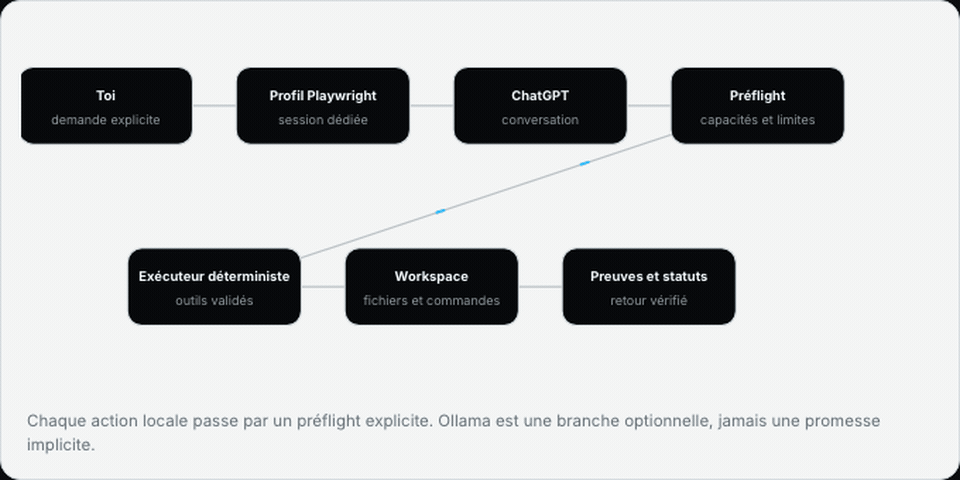

# Cortex Bridge

Cortex Bridge links a real ChatGPT conversation in Google Chrome to a reviewed
executor on your Mac. Chat messages remain ordinary ChatGPT messages. Local
execution starts only after a separate preflight shows the workspace,
capabilities, approvals, and limits.

> **Release status:** v0.5 is a technical release candidate ready for owner
> approval. Owner-authorized acceptance passed against a real signed-in ChatGPT
> tab, but this consumer-site automation is not an officially supported OpenAI
> integration. Review the current
> [OpenAI Europe Terms of Use](https://openai.com/policies/eu-terms-of-use/)
> before distribution or production use.



[Static architecture image](docs/media/architecture-flow.png)

## What v0.5 does

- Uses the person's existing Google Chrome profile through a packaged local
  extension; Cortex and ChatGPT stay in the same Chrome window.
- Opens or focuses `https://chatgpt.com/` with **Open and connect ChatGPT**,
  then verifies login, CAPTCHA, loading, composer, and tab state.
- Loads at most the latest 50 conversations and groups exposed Pinned,
  Projects, and Recent metadata without inventing it.
- Sends the exact composer draft to ChatGPT. `Enter` sends and `Shift+Enter`
  adds a line.
- Keeps two writing conversations isolated. A third keeps its draft and file
  but is rejected before any browser action.
- Shows independent ChatGPT and local-agent status in French.
- Collapses Cortex mission instructions, decisions, and reports behind **Voir
  le protocole** while keeping the complete technical exchange available for
  audit.
- Supports staged files up to the Chrome bridge's 25 MiB v0.5 transfer limit
  and visible ChatGPT-tab screenshots. ChatGPT may enforce stricter limits.
- Stores mutable runtime state under `CORTEX_HOME`, outside the repository.

The deterministic executor works without Ollama. Ollama is optional. No OpenAI
API is used. Login, terms, CAPTCHA, rate limits, and security checks remain
human actions.

## Install on macOS

Requirements: [Google Chrome](https://www.google.com/chrome/),
[Python 3.11+](https://www.python.org/downloads/macos/),
[Git](https://git-scm.com/download/mac), and a ChatGPT account.

First inspect the immutable plan:

```bash
./scripts/install.sh --dry-run --json
```

Approve the exact returned hash:

```bash
./scripts/install.sh --approve-plan PLAN_HASH --json
./scripts/cortex.sh doctor --json
```

Chrome requires one explicit manual step for an unpacked local extension:

1. open `chrome://extensions`;
2. enable **Developer mode**;
3. choose **Load unpacked**;
4. select the absolute `chrome_extension_path` printed by the installer;
5. start Cortex and open `http://127.0.0.1:8420` in that Chrome window;
6. press **Open and connect ChatGPT**.

```bash
./scripts/cortex.sh start
```

If ChatGPT is logged out, Cortex opens the tab and shows **Retry** and **Close**.
Sign in in Chrome, then retry. Cortex never enters credentials or solves a
challenge.

Full instructions:

- [Installation guide](INSTALL.md)
- [Agent-assisted installation](docs/agent-installation.md)
- [User guide](docs/user-guide.md)
- [Testing](docs/testing.md)
- [Security model](docs/security-model.md)
- [Troubleshooting](docs/troubleshooting.md)

## Verification boundary

Automated gates cover the backend, extension protocol, frontend, responsive
views, accessibility, two-writer isolation, 10-second switching, installation,
process ownership, dependencies, and privacy. Separate owner-authorized live
acceptance covers one real conversation, two isolated writers, refusal of a
third writer, a text file, an explicitly authorized screenshot, closed-tab
recovery, and three autonomous mini-sites.

See [release evidence](docs/verification/v0.5.0.json). Live tests prove the
observed technical behavior only; they do not imply provider endorsement.

## Development

```bash
python3 -m venv .venv
.venv/bin/python -m pip install --require-hashes -r requirements.lock
cd frontend && ../scripts/npmw ci && cd ..
PYTHON=.venv/bin/python ./scripts/test-all.sh
```

Playwright Chromium is a development and synthetic-test dependency only. It is
not the normal user connection and is never selected as a silent fallback.

## Security summary

- HTTP and WebSocket services bind to loopback.
- Pairing tokens have 256 bits of entropy, expire after 60 seconds, and are
  single use.
- Extension host access is limited to `chatgpt.com` and
  `127.0.0.1:8420`; it requests no cookie, password, history, or all-sites
  permission.
- The backend sends structured allowlisted commands, never remote JavaScript.
- Concurrent extension commands are serialized, and the same deadline bounds
  both WebSocket delivery and the correlated response.
- Attachments use opaque staging tokens and managed paths.
- Delivery uncertainty never triggers an automatic resend.
- Workspace paths, symlinks, process commands, and approvals fail closed.

Read [SECURITY.md](SECURITY.md) before enabling local write or process access.

## Repository map

```text
chrome-extension/  Manifest V3 bridge for the user's Chrome tabs
console/           FastAPI API, WebSocket pairing, settings, chat and missions
executor/          Reviewed local tools and process policy
frontend/          React/Next.js interface and browser tests
orchestration/     Mission protocol, state machine and SQLite store
transport/         Chrome-extension driver, development drivers and fixtures
scripts/           Lifecycle, installation and release gates
tests/             Backend, security, packaging and acceptance contracts
docs/              Architecture, user, security and release documentation
```

## Known boundaries

- macOS and Google Chrome 116+ are the v0.5 target.
- An unpacked extension requires one manual installation. Chrome Web Store
  packaging is a later distribution step.
- The v0.5 extension transfer limit is 25 MiB per file.
- ChatGPT DOM changes can temporarily break selectors; Cortex reports the
  failure and never substitutes another browser.
- Live acceptance remains blocked until an officially supported provider
  transport can pass it.

## Contributing and license

Read [CONTRIBUTING.md](CONTRIBUTING.md). MIT license; see [LICENSE](LICENSE).
