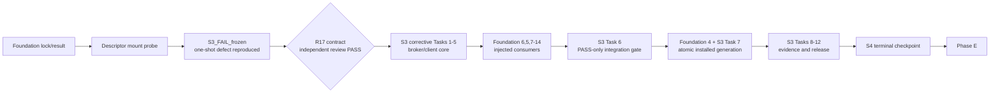

# Cortex Bridge v0.5.4 Completion Program

> **For agentic workers:** REQUIRED SUB-SKILL: Use superpowers:subagent-driven-development (recommended) or superpowers:executing-plans to implement this plan task-by-task. Steps use checkbox (`- [ ]`) syntax for tracking.

**Goal:** Execute the approved v0.5.4 architecture to one honestly verified macOS candidate by integrating the storage foundation plus its mandatory S3 corrective subphase and the four downstream plans in strict dependency order, with exact ownership, reviews, and stop gates.

**Architecture:** Storage establishes the only trusted runtime/workspace authority, with S3 as its sole native disk-operation backend, and constructs vault-only `WorkspaceHandle` values. Durable effects consume that handle, implement the fixed attested local-alias worker, and remain the sole mutation/STOP authority. UI/browser reliability consumes storage/effect truth and displays local actions without becoming an authority. The hybrid intent phase separates `GeneralMission` from `LocalAliasAction`; live cutover/QA begins only after the implementation graph is green. Each phase has one writer per file, an atomic commit set, and an independent read-only checkpoint.

**Tech Stack:** Python 3.11/3.14, FastAPI/SQLite, Swift/Security.framework, macOS APFS/DiskImages, Bash, Chrome MV3, React/TypeScript/Vitest/Playwright, Git/Gitleaks.

**Spec:** `docs/superpowers/specs/2026-09-02-storage-cutover-and-qa-design.md` at SHA-256 `30b74475822692388d07a3d3891d12ab625feb0d5cc209b699933c54f8589b4c`; `docs/superpowers/specs/2026-08-31-hybrid-intent-router-design.md` at SHA-256 `472ae88687f6df00be1aac7bb33af536b0456fdc7fd04b7bb5f95e637e4b38f5`; `docs/superpowers/specs/2026-09-03-local-alias-action-addendum.md` at SHA-256 `38dff2d114ddf3a8f2262f3ac2b37dcbec9fd33951934c5d5c03a9a0c4acc08b`; and `docs/superpowers/specs/2026-09-03-s3-owned-process-supervision-design.md` at SHA-256 `6fbdd97785391bb94a3314be8486d9c3915f2e1719bbb39f866727bd22daa7de`.

**Review-status provenance:** Approval attaches only to the four exact spec
hashes above through the reviewed planning-handoff commit; any byte change
resets it. `S3_FAIL_frozen` records the rejected legacy boundary, while the R17
S3 hash is the corrective candidate requiring its own independent PASS review.
The current ledger deliberately blocks S4 until that review is recorded;
documentary approval never authorizes a live effect.

## Global Constraints

- Execute phases in order. No downstream writer starts before the preceding phase has a committed implementation, passing focused/full gates, and a zero-P0/P1/P2 review.
- Use one implementation writer per file at a time. Reviewers are read-only and receive the exact commit hash, not another reviewer's verdict.
- Treat the subordinate plan as authoritative for its code, tests, RED/GREEN commands, and atomic commits. This program defines sequencing and gates; it does not dilute or replace those steps.
- Never alter a spec, threshold, test matrix, weight, evidence rule, or verdict merely to make a phase pass.
- A failure stops the program. Reproduce it, add/fix the regression at its owning phase, rerun that phase, obtain a fresh review, then resume; do not skip forward.
- Design approval does not authorize live vault, Keychain, filesystem, process, Chrome, ChatGPT, push, merge, tag, release, cleanup, or deletion effects.
- Keep the legacy sparsebundle detached and unmodified. Keep all public documentation English and product UI French.
- Do not use the OpenAI API or a separate browser profile as a substitute for the real signed-in Chrome-extension path.
- Never convert Desktop, Documents, or Downloads into a `WorkspaceHandle` or general-mission grant. Never disable or substitute required storage to admit a local action. Startup, routing, and finalization must not open a protected alias; only the separately confirmed access check or the approved local write may do so through the bounded worker.
- No push, merge, tag, release, external message, duplicate deletion, or Windows support claim belongs to this implementation program.

## Dependency and ownership map

| Phase | Plan | Creates the authority used downstream | Shared-file rule |
| --- | --- | --- | --- |
| 1 | `2026-09-02-v054-storage-runtime-foundation.md` plus mandatory corrective `2026-09-03-s3-owned-process-supervision.md` | Stable locked bootstrap, persistent broker, durable recovery authority, reconciled `StorageLifecycle`, `StorageContract`, `StorageBinding`, vault-only `WorkspaceHandle`, lifespan-bound runtime readiness, transaction/CLI and managed start | One storage writer owns the union of both file maps until checkpoint S4 |
| 2 | `2026-09-02-v054-durable-effects-and-executor.md` | schema v3 `EffectGate`, exact approvals, durable STOP, effect-bound `ToolExecutor`/browser permits, fixed attested `LocalAliasWorkerRunner` | Begins only after S; sole writer of executor/orchestration/direct-effect/worker-install files until checkpoint E |
| 3 | `2026-09-02-v054-runtime-ui-and-browser-reliability.md` | authoritative runtime projection, local-action presentation, switch deadlines, tab provenance, categories, diagnostic export | Begins only after E; owns shared `console/chat.py`, extension and frontend files until checkpoint U |
| 4 | `2026-09-02-v054-hybrid-intent-router.md` | deterministic/local-model routing, clarification, `GeneralMission`/`LocalAliasAction` split, alias catalog/access/finalization services | Begins only after U; consumes rather than redefines storage/effect/UI contracts until checkpoint I |
| 5 | `2026-09-02-v054-live-cutover-and-release-qa.md` | live storage/runtime/evidence verdict, including zero-chat `LOCAL_ALIAS` acceptance, for v0.5.4 | Begins only after I; product fixes return to the owning phase rather than being patched in QA |

## Frozen subordinate plan hashes

| Phase | Plan | SHA-256 |
| --- | --- | --- |
| S | `docs/superpowers/plans/2026-09-02-v054-storage-runtime-foundation.md` | `d6a2f13e32dfc1ff9abaed9b84d160d1a06cc406bdd146a2a174708dff05674b` |
| S3 | `docs/superpowers/plans/2026-09-03-s3-owned-process-supervision.md` | `be2141907c09c25e4d674c02af96b9f74f9d0d6fbc021ac819e8c5b9705ca227` |
| E | `docs/superpowers/plans/2026-09-02-v054-durable-effects-and-executor.md` | `b98b88a54bc27543555c465839ff1bea912fc343514fa3ffdf15caecfe61ffe1` |
| U | `docs/superpowers/plans/2026-09-02-v054-runtime-ui-and-browser-reliability.md` | `25d04484e4dcf337728ce96f0af642d3894be71dea0ef9a616f2552cd9121245` |
| I | `docs/superpowers/plans/2026-09-02-v054-hybrid-intent-router.md` | `bcd7a77dbf344c05f60238be326b6a96d853ec8063777e10931b0041502ef6a6` |
| L | `docs/superpowers/plans/2026-09-02-v054-live-cutover-and-release-qa.md` | `b8dda2316401eaee1b6408aa6cc68136b783524d6b99e5b30f64db7c30e83277` |

## Phase S corrective graph



`S3_FAIL_frozen` is a required failing baseline, not executable production and
not a waived gate. The R17 `S3_corrective` contract must be reviewed PASS before
the first core or consumer implementation edit. The only execution order is
Foundation 1-2 → S3 1-5 → Foundation 6,5,7-14 → PASS-only S3 Task 6 → atomic
Foundation 4/S3 Task 7 → S3 8-12. S4 is the resulting terminal checkpoint, not
an implementation task that may start independently; no one-shot disk helper
survives that handoff.

## Planning handoff gate

Before implementation, the planning owner creates one R17 documentation
candidate commit containing exactly the eight corrected files below. Other frozen
specifications and plans remain byte-identical. This is a later handoff step;
the documentation author does not stage or commit while revising the contract.

```bash
git add \
  docs/superpowers/specs/2026-09-02-storage-cutover-and-qa-design.md \
  docs/superpowers/specs/2026-09-03-s3-owned-process-supervision-design.md \
  docs/superpowers/plans/2026-09-02-v054-storage-runtime-foundation.md \
  docs/superpowers/plans/2026-09-03-s3-owned-process-supervision.md \
  docs/superpowers/plans/2026-09-02-v054-durable-effects-and-executor.md \
  docs/superpowers/plans/2026-09-02-v054-hybrid-intent-router.md \
  docs/superpowers/plans/2026-09-02-v054-completion-program.md \
  docs/superpowers/plans/2026-09-02-v054-completion-ledger.json
git diff --cached --check
git diff --cached --name-only
EXPECTED_STAGED="$(printf '%s\n' \
  docs/superpowers/specs/2026-09-02-storage-cutover-and-qa-design.md \
  docs/superpowers/specs/2026-09-03-s3-owned-process-supervision-design.md \
  docs/superpowers/plans/2026-09-02-v054-storage-runtime-foundation.md \
  docs/superpowers/plans/2026-09-03-s3-owned-process-supervision.md \
  docs/superpowers/plans/2026-09-02-v054-durable-effects-and-executor.md \
  docs/superpowers/plans/2026-09-02-v054-hybrid-intent-router.md \
  docs/superpowers/plans/2026-09-02-v054-completion-program.md \
  docs/superpowers/plans/2026-09-02-v054-completion-ledger.json | LC_ALL=C sort)"
ACTUAL_STAGED="$(git diff --cached --name-only | LC_ALL=C sort)"
test "$ACTUAL_STAGED" = "$EXPECTED_STAGED"
git commit -m "docs: integrate R17 S3 corrective storage contract"
```

The staged-name output contains those eight paths exactly. Frozen tables bind
four specs and six subordinate plans. The ledger records the master-plan hash,
but the master contains neither its own hash nor the ledger hash; no self-hash
cycle exists. A mismatch stops handoff. The implementation owner never creates
or repairs this baseline.

After that candidate commit, an independent read-only reviewer examines its
exact S3 design and plan hashes and returns a durable review ID plus
`PASS|FAIL|UNCLEAR`. Only `PASS` permits the root integrator to update and commit
the ledger alone: `S3_corrective.review_id`, reviewed design/plan hashes, and
verdict become immutable; `S4.depends_on_review_id` receives the same ID and
`planning_commit` and `S4.base_commit` receive the already known eight-document
candidate commit. `FAIL` or `UNCLEAR` leaves S4 blocked. The integrator stages
and commits only the ledger after verifying that update. The gate commit itself
is deliberately not stored inside its own bytes; S4 starts at its child HEAD
and verifies the candidate commit is an ancestor. No S4 source or test file may
be modified before this second commit.

```bash
python3 -m json.tool \
  docs/superpowers/plans/2026-09-02-v054-completion-ledger.json >/dev/null
git add docs/superpowers/plans/2026-09-02-v054-completion-ledger.json
test "$(git diff --cached --name-only)" = \
  "docs/superpowers/plans/2026-09-02-v054-completion-ledger.json"
git diff --cached --check
git commit -m "docs: record S3 corrective review gate"
```

---

### Task 1: Establish the immutable planning baseline

**Files:**
- Inspect: `docs/superpowers/specs/2026-09-02-storage-cutover-and-qa-design.md`
- Inspect: `docs/superpowers/specs/2026-08-31-hybrid-intent-router-design.md`
- Inspect: `docs/superpowers/specs/2026-09-03-local-alias-action-addendum.md`
- Inspect: `docs/superpowers/specs/2026-09-03-s3-owned-process-supervision-design.md`
- Inspect: `docs/superpowers/plans/2026-09-02-v054-storage-runtime-foundation.md`
- Inspect: `docs/superpowers/plans/2026-09-03-s3-owned-process-supervision.md`
- Inspect: `docs/superpowers/plans/2026-09-02-v054-durable-effects-and-executor.md`
- Inspect: `docs/superpowers/plans/2026-09-02-v054-runtime-ui-and-browser-reliability.md`
- Inspect: `docs/superpowers/plans/2026-09-02-v054-hybrid-intent-router.md`
- Inspect: `docs/superpowers/plans/2026-09-02-v054-live-cutover-and-release-qa.md`
- Inspect: `docs/superpowers/plans/2026-09-02-v054-completion-program.md`
- Inspect and update only through root integration: `docs/superpowers/plans/2026-09-02-v054-completion-ledger.json`
- Modify during execution only: `primer.md`

**Interfaces:**
- Consumes: the already completed planning handoff gate and its local documentation commit.
- Produces: base commit, spec hashes, plan hashes, clean/known Git status, equipped Python paths, and phase ledger.

- [ ] **Step 1: Verify frozen bytes and branch**

```bash
GATE_COMMIT="$(git rev-parse HEAD)"
PLANNING_COMMIT="$(python3 -c 'import json; print(json.load(open("docs/superpowers/plans/2026-09-02-v054-completion-ledger.json"))["planning_commit"])')"
git merge-base --is-ancestor "$PLANNING_COMMIT" "$GATE_COMMIT"
git rev-parse --abbrev-ref HEAD
git status --short
shasum -a 256 docs/superpowers/specs/2026-09-02-storage-cutover-and-qa-design.md
shasum -a 256 docs/superpowers/specs/2026-08-31-hybrid-intent-router-design.md
shasum -a 256 docs/superpowers/specs/2026-09-03-local-alias-action-addendum.md
shasum -a 256 docs/superpowers/specs/2026-09-03-s3-owned-process-supervision-design.md
shasum -a 256 \
  docs/superpowers/plans/2026-09-02-v054-storage-runtime-foundation.md \
  docs/superpowers/plans/2026-09-03-s3-owned-process-supervision.md \
  docs/superpowers/plans/2026-09-02-v054-durable-effects-and-executor.md \
  docs/superpowers/plans/2026-09-02-v054-runtime-ui-and-browser-reliability.md \
  docs/superpowers/plans/2026-09-02-v054-hybrid-intent-router.md \
  docs/superpowers/plans/2026-09-02-v054-live-cutover-and-release-qa.md \
  docs/superpowers/plans/2026-09-02-v054-completion-program.md
git ls-files --error-unmatch \
  docs/superpowers/specs/2026-09-02-storage-cutover-and-qa-design.md \
  docs/superpowers/specs/2026-08-31-hybrid-intent-router-design.md \
  docs/superpowers/specs/2026-09-03-local-alias-action-addendum.md \
  docs/superpowers/specs/2026-09-03-s3-owned-process-supervision-design.md \
  docs/superpowers/plans/2026-09-02-v054-storage-runtime-foundation.md \
  docs/superpowers/plans/2026-09-03-s3-owned-process-supervision.md \
  docs/superpowers/plans/2026-09-02-v054-durable-effects-and-executor.md \
  docs/superpowers/plans/2026-09-02-v054-runtime-ui-and-browser-reliability.md \
  docs/superpowers/plans/2026-09-02-v054-hybrid-intent-router.md \
  docs/superpowers/plans/2026-09-02-v054-live-cutover-and-release-qa.md \
  docs/superpowers/plans/2026-09-02-v054-completion-program.md
git diff --exit-code "$PLANNING_COMMIT" -- \
  docs/superpowers/specs/2026-09-02-storage-cutover-and-qa-design.md \
  docs/superpowers/specs/2026-08-31-hybrid-intent-router-design.md \
  docs/superpowers/specs/2026-09-03-local-alias-action-addendum.md \
  docs/superpowers/specs/2026-09-03-s3-owned-process-supervision-design.md \
  docs/superpowers/plans/2026-09-02-v054-storage-runtime-foundation.md \
  docs/superpowers/plans/2026-09-03-s3-owned-process-supervision.md \
  docs/superpowers/plans/2026-09-02-v054-durable-effects-and-executor.md \
  docs/superpowers/plans/2026-09-02-v054-runtime-ui-and-browser-reliability.md \
  docs/superpowers/plans/2026-09-02-v054-hybrid-intent-router.md \
  docs/superpowers/plans/2026-09-02-v054-live-cutover-and-release-qa.md \
  docs/superpowers/plans/2026-09-02-v054-completion-program.md
```

Expected: branch `codex/v054-storage-consolidation`; `PLANNING_COMMIT` is the
reviewed eight-document R17 candidate, `GATE_COMMIT` is its ledger-only child,
and both are ancestors of the implementation HEAD. All four specs and seven
plans in the baseline are tracked and byte-identical to frozen hashes; only the
review fields differ between candidate and gate commits. If not, stop with
`FAIL`.

- [ ] **Step 2: Equip runtimes without changing dependency locks**

Resolve the repository's supported Python 3.11 and 3.14 interpreters and existing locked frontend install. Record executable versions. Do not upgrade Remotion, npm, Python packages, or any unrelated dependency during this program.

- [ ] **Step 3: Create the phase ledger**

The root integrator alone owns `docs/superpowers/plans/2026-09-02-v054-completion-ledger.json`. Schema version 3 records the planning commit, master-plan hash, four spec hashes, six subordinate-plan hashes, phases `S/E/U/I/L`, and Phase S subphases `S3_FAIL_frozen`, `S3_corrective`, and terminal checkpoint `S4`. `S3_FAIL_frozen.status` is the documentary baseline label and its review verdict is `FAIL`; it is never a release waiver. `S3_corrective` stores the independent review ID, exact reviewed design/plan hashes, and verdict. `S4` stores `depends_on_review_id`, base and terminal commits, and the closed interface-signature map. Before the independent R17 review these fields are null and Phase S implementation is explicitly blocked; after PASS the dependency and base are recorded before any core edit, while terminal/signature fields stay null until the full DAG completes. Valid review verdicts remain `PASS`, `FAIL`, or `UNCLEAR`. The master has no self-hash and does not hash the ledger; after subordinate hashes are frozen, compute the master hash once and write it only into the ledger.

---

### Task 2: Execute Phase S — storage and runtime foundation

**Files:**
- Follow exactly: `docs/superpowers/plans/2026-09-02-v054-storage-runtime-foundation.md`
- Follow at the mandated interleave: `docs/superpowers/plans/2026-09-03-s3-owned-process-supervision.md`

**Interfaces:**
- Produces for Phase E:

```python
InstalledStorageRuntime.from_installed_home_locked(home, lock_set, bootstrap_handle) -> InstalledStorageRuntime
launch_managed_runtime(home, *, lock_set, lifecycle, contract, timeout_seconds=5.0) -> ManagedStartReceipt
StorageContract.open_locked(lock_set) -> StorageBinding
StorageContract.open_workspace_locked(lock_set, binding, requested) -> WorkspaceHandle
StorageContract.assert_runtime_ready_locked(lock_set) -> StorageStatus
WorkspaceHandle.revalidate() -> WorkspaceIdentity
WorkspaceHandle.duplicate_workspace_fd() -> int
```

- [ ] **Step 0: Enforce the R17 corrective review gate before Phase S**

Load the ledger before touching any Phase S source or test. Require
`S3_corrective.review_verdict == "PASS"`, non-null review ID, exact reviewed
design and plan hashes matching the frozen tables, and
`S4.depends_on_review_id == S3_corrective.review_id`. Require `S4.base_commit`
to equal the reviewed `planning_commit`, require that commit to be an ancestor
of the current ledger-gate HEAD, and require every terminal/signature field to
remain null. Any mismatch stops with `FAIL`; it is forbidden to implement first
and fill the prerequisite afterward.

- [ ] **Step 1: Dispatch one storage implementation owner**

Use this exact handoff:

```text
Implement Phase S using the sole DAG in docs/superpowers/plans/2026-09-02-v054-storage-runtime-foundation.md and the mandatory corrective docs/superpowers/plans/2026-09-03-s3-owned-process-supervision.md. Freeze the reproduced one-shot defect as S3_FAIL_frozen; never implement that helper route. Build S3 broker/client core with injected attestation, then Foundation consumers with injected backends, run the PASS-only S3 integration gate, and only then commit the atomic stable-bootstrap/installed-generation unit. Every lifecycle/contract/transition/ledger/broker operation carries the same active StorageLockSet. Require owner-connection-bound START, durable non-START recovery authority, retained-broker mutating-effect reconciliation, read-only no-reconciliation closure, and STARTING→READY→CLOSED runtime truth before admission/update/uninstall. Keep WorkspaceHandle vault-only. Do not run production Keychain/vault/cutover actions. Preserve unrelated changes and stop on any failed gate.
```

- [ ] **Step 2: Verify checkpoint S**

Run every focused command from both storage plans through the shared versioned
module inventory under Python 3.11/3.14, then the full gate, diff and Gitleaks
checks. A skipped/missing native broker module or unreconciled effect is `FAIL`.

- [ ] **Step 3: Obtain independent storage review**

Give a read-only reviewer the Phase S base and terminal commits plus all four frozen specs. Require zero P0/P1/P2, including S3 ownership/capability/reconciliation/install/evidence proof and proof that local actions cannot bypass storage or managed-start truth.

- [ ] **Step 4: Freeze handoff S**

Preserve the already recorded `S3_corrective` review fields. Record the terminal
`S4` commit and the closed signature-digest map for
`InstalledStorageRuntime.from_installed_home_locked`,
`launch_managed_runtime`,
`StorageContract.open_locked`, `StorageContract.open_workspace_locked`,
`StorageContract.assert_runtime_ready_locked`,
`WorkspaceHandle.revalidate`, and `WorkspaceHandle.duplicate_workspace_fd`.
Record focused/full gates and the independent Phase S review. Phase E may
import these fields; it may not redesign them silently.

---

### Task 3: Execute Phase E — durable effects and executor

**Files:**
- Follow exactly: `docs/superpowers/plans/2026-09-02-v054-durable-effects-and-executor.md`

**Interfaces:**
- Consumes: Phase S `WorkspaceHandle` and `StorageContract`.
- Produces for Phase U/I:

```python
EffectGate.activate_mission_effect(...) -> EffectActivation
EffectGate.begin_direct_intent(...) -> EffectIntent
EffectGate.activate_direct_intent(effect_id: str, *, blocked_worker_permit: BlockedWorkerActivationPermit | None = None) -> EffectActivation
EffectGate.register_local_alias_approval(*, action_id: str, grant_id: str, catalog_entry_id: str, catalog_revision: int, alias: LocalAlias, operation: Literal["create_directory"], allowed_leaf: str, payload_digest: str, authorization_epoch: int) -> LocalAliasApprovalChallenge
EffectGate.local_alias_approval_receipt(*, action_id: str, epoch: int, arguments_digest: str) -> LocalAliasApprovalReceipt
EffectGate.begin_local_alias_intent(*, action_id: str, epoch: int, operation: Literal["create_directory"], payload_digest: str, grant_id: str) -> EffectIntent
EffectGate.activate_local_alias_intent(effect_id: str, *, approval: LocalAliasApprovalReceipt, blocked_worker_permit: BlockedWorkerActivationPermit) -> EffectActivation
EffectGate.request_stop() -> StopStatus
EffectGate.reset_stop(*, expected_epoch: int) -> StopStatus
ToolExecutor(workspace: WorkspaceHandle, *, effect_gate: EffectGate, test_commands=...)
LocalAliasWorkerRunner(effect_gate: EffectGate, installed_home: Path, storage_contract: StorageContract)
LocalAliasWorkerRunner.assert_pre_activation_ready(*, intent: EffectIntent) -> BlockedWorkerActivationPermit
LocalAliasWorkerRunner.run(*, request: LocalAliasWorkerRequest, activation: EffectActivation, deadline_seconds: Literal[60] = 60) -> LocalAliasWorkerReceipt
```

- [ ] **Step 1: Dispatch one effect implementation owner**

```text
Implement docs/superpowers/plans/2026-09-02-v054-durable-effects-and-executor.md task by task with TDD on top of checkpoint S. Consume WorkspaceHandle exactly; do not reopen absolute workspace paths or alter the storage contract. Migrate effects to schema v3, keep ToolExecutor vault-only, and implement the manifest-owned fixed local-alias worker plus bounded runner exactly as planned; this worker is not a general process capability. You own only files named by the plan. Do not edit UI/intent/live/spec/primer files. Preserve unrelated changes. Stop on a failed gate, fix root cause, and commit each atomic task as specified.
```

- [ ] **Step 2: Verify checkpoint E**

Run all effect/approval/STOP/executor/browser-permit/local-worker focused tests, then the full gate under both required Python versions, extension tests, Gitleaks scans, and diff checks. Prove schema v2→v3 rebuilds both approvals and effects while creating the four local tables in one immediate transaction, preserves recognized mission approvals by exact row count/digest, enforces typed-subject XOR/partial indexes, and rejects cross-subject nonce replay. Also prove exact effect registry equality, legacy mutating POST routes returning 410 with zero effect, worker attestation before spawn, blocked-process ownership before release, strict 60-second termination, full descriptor-chain checks, and no local-handle entry into ToolExecutor.

- [ ] **Step 3: Obtain independent safety review**

Require the reviewer to trace every direct, mission, local-alias, admin, browser, filesystem, process, sensitive-read, attachment, settings, onboarding, STOP and reset path to `EffectGate`. The accepted owner set must be exactly `mission|direct_ui|admin_ui|local_alias_action`; categories must be exactly `filesystem|process|browser|sensitive_read`. Any first byte before durable activation, worker release before durable PID/PGID/start ownership, or local-alias access through a generic executor is P0 and blocks U.

- [ ] **Step 4: Freeze handoff E**

Record terminal commit, schema version 3, exact effect inventory, installed worker hash/device/inode/owner/mode, and exact HTTP/Python contracts. Client-supplied `owner_kind` or effect `category` is forbidden; routes derive both server-side.

---

### Task 4: Execute Phase U — runtime UI and browser reliability

**Files:**
- Follow exactly: `docs/superpowers/plans/2026-09-02-v054-runtime-ui-and-browser-reliability.md`

**Interfaces:**
- Consumes: Phase S runtime/storage observations and Phase E effect/browser/local-worker permits and receipts.
- Produces: one authoritative UI projection, truthful `Action locale` access/preflight/active/created/uncertain states, cache-first bounded switches, safe tab provenance, useful categories, and observable diagnostic export. It creates no model, executor, storage, alias, approval, or effect authority.

- [ ] **Step 1: Dispatch one sequential UI/browser owner**

```text
Implement docs/superpowers/plans/2026-09-02-v054-runtime-ui-and-browser-reliability.md task by task with TDD on checkpoints S and E. You are the sole writer of every shared console/chat, extension, and frontend file during this phase. Consume storage/effect/local-worker contracts without redefining them. Render local-action truth in French, including per-alias access verification, possible macOS prompt, no-ChatGPT capability statement, and outcome-unclear warning; do not place an executor or model in the frontend. Do not edit intent/live/spec/primer files. Preserve unrelated changes; stop and report any failed gate; commit atomically as specified.
```

- [ ] **Step 2: Verify checkpoint U**

Run the named backend/extension/frontend unit, runtime, typecheck, lint, fresh build, tagged E2E, and accessibility commands. Require non-zero test selection, deterministic fault trace, no hidden production fault endpoint, no background protected-alias access, and accurate keyboard/live-region behavior for verification-required, active, created, denied, permission-required, STOP, and outcome-unclear states.

- [ ] **Step 3: Obtain independent runtime/UX review**

Review exact bytes for contradictory readiness, false local-action success, any claim that ChatGPT/model/executor performed a local action, stale/superseded conversation state, unsafe user-tab closure/reuse, dead archive control, ambiguous icons/copy, silent diagnostics, privacy leaks, and accessibility regressions.

- [ ] **Step 4: Freeze handoff U**

Record terminal commit, local-action selectors/state mapping, response schemas, timeout constants, and extension provenance fields. Phase I may bind routing state to them but may not add a second truth source.

---

### Task 5: Execute Phase I — hybrid intent router

**Files:**
- Follow exactly: `docs/superpowers/plans/2026-09-02-v054-hybrid-intent-router.md`

**Interfaces:**
- Consumes: `StorageContract`, vault-only `WorkspaceHandle`, `EffectGate`, `LocalAliasWorkerRunner`, repaired conversation state, two-writer admission, and real Chrome-extension transport.
- Produces: exact chat, vault-backed `GeneralMission`, separate `LocalAliasAction`, ambiguous clarification, per-alias access observation/grant/action persistence, and safe fallback routes from one composer.

- [ ] **Step 1: Dispatch one intent implementation owner**

```text
Implement docs/superpowers/plans/2026-09-02-v054-hybrid-intent-router.md task by task with TDD on checkpoints S, E, and U. Do not create a parallel approval, workspace, conversation, browser, effect, or worker authority. Keep general missions vault-only. Standard aliases are server-owned local-action targets, never WorkspaceGrants. The local Ollama model is optional and never selects or overrides execution class, alias, leaf, grant, approval, owner kind, category, or policy. You own only the files named by the plan. Preserve unrelated changes, stop on failures, and commit atomically as specified.
```

- [ ] **Step 2: Verify checkpoint I**

Run pure routing, schema-v3 migration, backend, extension, frontend, tagged E2E, privacy, and exact-chat regressions. Prove the obvious Desktop request freezes `execution_class=local_alias_action` through deterministic rules before ChatGPT, uses no model, creates zero mission/writer/outbox/browser/extension artifact, performs no alias open during startup/routing/finalization, and cannot proceed when storage readiness or a current access observation is absent. Prove ambiguity never causes an external send and classifier absence/invalidity falls back safely.

- [ ] **Step 3: Obtain independent architecture/security/UX reviews**

All three review the same terminal commit and all three frozen specs. Require zero P0/P1/P2, then re-run full gates after every fix. A model-only routing claim, an ordinary ChatGPT refusal, a general mission, a WorkspaceGrant, or a browser/extension command for the frozen obvious-local phrase is `FAIL`.

- [ ] **Step 4: Freeze handoff I**

Record terminal commit, exact execution-class/local-alias registries, candidate setting defaults, and the negative-capability inventory. Do not run the live Desktop acceptance here; that belongs to Phase L and needs separate access-check and write action-time approvals.

---

### Task 6: Execute Phase L — live cutover and release QA

**Files:**
- Follow exactly: `docs/superpowers/plans/2026-09-02-v054-live-cutover-and-release-qa.md`

**Interfaces:**
- Consumes: frozen checkpoints S, E, U, and I.
- Produces: storage/runtime/install evidence, T12-T18, R1-R5, and distinct `LOCAL_ALIAS` verdicts, privacy manifest, reviewed public aggregate evidence, and a stopped candidate.

- [ ] **Step 1: Dispatch a QA recorder owner before live effects**

```text
Implement only the code/test tasks in docs/superpowers/plans/2026-09-02-v054-live-cutover-and-release-qa.md first. Do not mutate Keychain, disks, production CORTEX_HOME, Chrome, ChatGPT, or a live workspace. Stop after the pre-live gates and report every exact action-time approval still required.
```

- [ ] **Step 2: Verify the code-ready live checkpoint**

Review the evidence recorder/manifest implementation, run full gates and scans, and freeze its commit. Only then proceed through live tasks one authorization boundary at a time.

- [ ] **Step 3: Execute live actions without bundling authority**

For each dry-run plan or external/browser/write/process/sensitive-read effect, show the exact target/content/impact and obtain only its required approval. The local-alias acceptance requires one explicit access-check authorization and a later distinct exact-directory write authorization; Cortex never accepts a macOS TCC prompt for the owner. A prior plan/spec/program approval is not accepted as runtime authority.

- [ ] **Step 4: Return defects to their owning phase**

If live QA reproduces a bug, mark the live gate `FAIL`, stop safely, add a RED test in S/E/U/I according to ownership, implement there, re-run/re-review that checkpoint and every downstream gate, then restart the affected live test with a new synthetic run ID.

- [ ] **Step 5: Verify checkpoint L**

Require every mandatory gate, including `LOCAL_ALIAS`, to be `PASS`, three independent frozen-evidence reviews, complete privacy/secret/full-suite gates, stopped runtime, detached vault, and clean intended Git state. `LOCAL_ALIAS` requires direct proof of one local access effect, one local filesystem effect, one exact inode, and zero ChatGPT/writer/mission/outbox/upload/browser/extension delta. Independent recovery may remain `UNCLEAR` only with synthetic/rebuildable data and must stay visible.

---

### Task 7: Close the candidate without publishing

**Files:**
- Modify: `primer.md`
- Inspect: `docs/verification/v0.5.4.json`
- Inspect: `docs/release-checklist.md`
- Inspect: complete candidate diff and private evidence manifest hash

**Interfaces:**
- Produces: an exact candidate commit, open limitations, Git status, and one separately gated publication decision.

- [ ] **Step 1: Recompose final proof from fresh sources**

Do not reuse narrative summaries. Re-run version, full tests, evidence verification, privacy, links, history/working-tree Gitleaks, diff check, status, and runtime stopped/detached probes.

- [ ] **Step 2: Update the project primer**

Keep it below 200 lines and record the five terminal commits/verdicts, exact next action, independent-recovery limitation, live evidence hash, and any blocker. Do not include a private path, user/account data, token, secret, or stale count.

- [ ] **Step 3: Obtain final independent candidate review**

Review the exact base-to-candidate diff plus all three frozen specs and the frozen public/private evidence boundary. Require `PASS` with zero P0/P1/P2; otherwise return to the owning phase.

- [ ] **Step 4: Report the boundary**

State candidate commit, tests/reviews, remaining `UNCLEAR` items, private evidence location by redacted label, and Git status. The sole next action is owner review of a separate push/merge/tag/release plan; do not perform it here.
