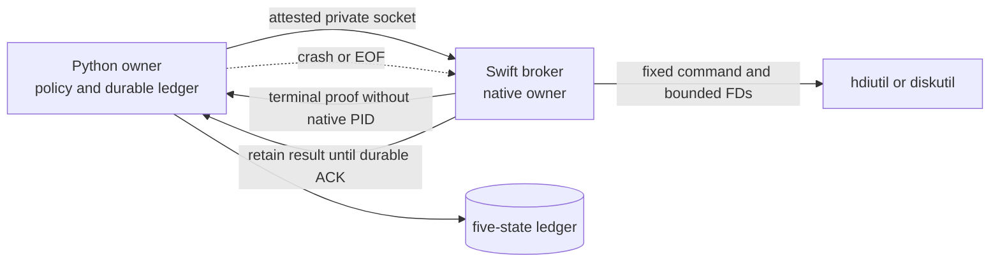

# Cortex Bridge S3 Owned-Process Supervision Design

**Status:** R17 corrective candidate awaiting independent PASS review; implementation and live evidence do not yet exist
**Target:** Cortex Bridge v0.5.4
**Scope:** macOS disk-image and Keychain storage workflows

## Decision

Each storage workflow has one persistent Swift broker. Only that broker may
spawn, identify, signal, wait for, or reap the workflow's `hdiutil` and
`diskutil` children. Python owns policy, orchestration, admission, and the
durable ledger, but receives no usable native child PID or PGID and invokes no
native-child signal or wait primitive.

The current disk helper is test-compiled only; it is not part of the installed
product. S3 must therefore create, integrate, and package both the broker and
its Python client. It must replace the one-shot helper boundary used by the
planned storage lifecycle, the guard, the operator CLI, and runtime start/stop.
There is no production fallback to a direct Python subprocess or one-shot disk
helper.

The reproduced baseline defect is that killing the current Swift helper leaves
its process-group child reparented to PID 1 until natural exit. S3 closes that
case only while the broker and kernel remain available. Loss of the broker
itself while it owns a native obligation is explicitly outside the no-orphan
claim and must remain durably unresolved.

## Threat model

S3 protects against:

- Python exit, crash, cancellation, terminal hangup, or control-channel EOF;
- controller process-group signals, because the broker is launched in a
  distinct session and process group;
- replayed, reordered, duplicated, stale-generation, wrong-nonce, oversized,
  truncated, or non-canonical protocol input;
- PID/PGID reuse and loss of child identity or waitability before TERM/KILL;
- path, mount, `/dev/disk` name, socket, ledger, or installed-artifact
  replacement at the validation boundaries defined here;
- secrets entering argv, environment, protocol, receipts, or logs;
- false success after `ECHILD`, lost channel, boot mismatch, uncertain
  identity, missing reap, group presence, or ambiguous terminal data.

S3 does not protect against kernel compromise, root, malicious same-UID action
inside the final path-based macOS syscall gap after all observable checks,
physical device removal, or any crash,
abort, forced termination, resource kill, or other loss of the broker while a
native obligation is open. In that last case S3 proves only that Python records
`OPEN_UNRESOLVED`, exposes no signal authority, and mints no native-cleanup or
no-orphan proof. It does not claim that the native child or group is absent.

S3 also does not claim that terminating `hdiutil` rolls back a partial disk
effect, or that application code erases immutable copies retained inside
Security.framework or kernel buffers.

## Ownership and isolation

The broker owns for its entire workflow:

- native child identity, original process group, waitability, streams, status,
  TERM/KILL decisions, exact reap, and group-absence observation;
- the closed operation-to-executable/argv mapping;
- Keychain access, application-owned secret buffers, and secret delivery;
- detach attestation and the exact device operand derived from it;
- terminal result retention until Python acknowledges a durably fsynced ledger
  record and, when required, a durably fsynced reconciliation record.

Python owns:

- public authorization, workflow generation, and storage-lock admission;
- the broker process identity and attested local connection, but not its native
  children;
- durable ledger transitions, recovery, and idempotent close acknowledgement.
- the private durable recovery root used to authenticate a successor controller;
  that root is never START authority and is erased only after `FINALIZED`.

Python may supervise or terminate a broker before `START`, but once the ledger
is `OPEN_RUNNING` it may only request cancellation or recovery through the
protocol. Installer and lifecycle code never signal a broker with an open or
unresolved workflow.

Python launches the broker with a new session and process group. The broker
does not share the controller's SID or PGID. It installs explicit handlers for
`SIGINT`, `SIGHUP`, and `SIGTERM`: while an obligation, unacknowledged terminal
result, or unfinished required reconciliation exists, these signals latch
shutdown intent but do not terminate the
broker; when idle, shutdown still follows the protocol close path. Normal
cancellation is `CANCEL` or client EOF. The broker ignores `SIGPIPE` with
`sigaction`; child SIGPIPE is reset to default before exec.

## Launch binding and boot identity

The client holds an `AttestedBrokerExecutable` containing an open read-only FD,
path, device, inode, owner, mode, and SHA-256. It also holds the shared install
lock from attestation through authenticated `HELLO`. Immediately before spawn,
the path must still name the FD's exact vnode and bytes. The broker opens and
hashes its own executable, reports that vnode identity and hash in `HELLO`, and
Python revalidates both the original FD and the path before accepting `HELLO`.
Any mismatch sends no `START` and creates no native effect.

The launcher also creates an unnamed private `AF_UNIX` socketpair before exec.
The broker inherits one `START_CAPABILITY_FD`; only the preparing Python process
holds its peer. After `OPEN_RUNNING` is fsynced, Python writes one canonical
`START_GRANT` binding `record_sha256`, `request_sha256`, operation, both
budgets, boot identity, workflow, generation, the accepted connection nonce,
and the SHA-256 of that connection's `LOCAL_PEERTOKEN` audit-token projection.
The broker consumes it once and accepts `START` only on that exact owner
connection when every field matches. `START`, `CANCEL`, `STATUS`, `CLOSE`,
`COMMIT_ACK`, `LATE_CLOSE`, `RECONCILE_PROBE`, and `RECONCILIATION_ACK` are
rejected on every non-owner connection. Recovery never recreates START
authority. A successor connection becomes owner only through the durable
recovery handshake below after the prior owner has reached EOF.

Before `OPEN_PREPARED`, Python generates a separate 256-bit recovery root,
writes it to a current-UID, single-link, no-follow mode `0600` authority file,
fsyncs that file and its owner-only directory, and records its digest and vnode
identity in the ledger. The broker receives the same root once through a
dedicated inherited FD, stores it only in mutable memory, and closes the FD.
For each recovery phase, the successor proves
`HMAC-SHA256(root, "CORTEX-S3\0RECOVERY\0V1\0" || canonical(projection))`, where
the projection contains workflow, generation, transaction, operation, request
digest, current result and closed-record digests or null before they exist,
boot identity, recovery phase, new connection nonce, and the new peer audit
token digest. The root or HMAC is never accepted by `START_GRANT` or `START`.
The broker consumes no durable recovery authority before `FINALIZED`: exact
retries on a newly authenticated owner connection remain possible. After
`FINALIZED`, it zeroes its root; Python unlinks the exact authority vnode and
fsyncs the directory. If Python dies in that last window, closed-ledger recovery
may delete the still-attested file without contacting an exited broker.

Broker exec receives exactly `PATH=/usr/bin:/bin:/usr/sbin:/sbin`, `LANG=C`,
and `LC_ALL=C`, constructed from constants. It receives no `HOME`, `DYLD_*`,
`PYTHON*`, virtualenv, or `CORTEX_*` entry. Before accepting the inherited
capability or opening Keychain/DiskImages, the broker verifies this exact
allowlist and rejects any additional entry.

This lock-and-FD protocol binds compliant install/update activity and detects
observable substitution around Darwin's path-based exec. It does not claim to
eliminate the malicious same-UID syscall gap excluded above.

Both sides derive `BootIdentity(seconds, microseconds)` from the exact
`kern.boottime` value. The broker reports it in `HELLO`; Python records it in the
ledger. An open record whose native effect may have started cannot be recovered
across a boot-identity mismatch and becomes `OPEN_UNRESOLVED`. A strictly
`OPEN_PREPARED` record may close as pre-exec failure because that state proves
that no `START` was sent.

## Durable launch ordering

The order is normative:

1. Under the storage lock, Python creates and fsyncs the recovery-authority file,
   then creates and fsyncs `OPEN_PREPARED` with its digest/vnode, the request
   digest, generation, budgets, boot identity, socket identity, and attested
   broker identity.
2. Python spawns the broker in its separate session with an exec-status pipe,
   the bound listener FD, the private START-capability FD, and the read end that
   transfers the durable recovery root. The broker cannot perform an effect
   before consuming the matching inherited START grant; recovery proof is not
   START authority.
3. Python observes exec-status EOF, authenticates `HELLO`, and verifies the
   broker self-identity against the still-open executable FD.
4. Python writes and fsyncs `OPEN_RUNNING`, then writes the exact single-use
   owner-connection-bound `START_GRANT` on the inherited capability.
5. Only then may Python send matching `START`; only then may the broker spawn a
   native child.

Therefore a crashed owner may close an intact `OPEN_PREPARED` record as
`CLOSED_FAILURE` when no matching broker is reachable: by construction no
effect was authorized. A crash after `OPEN_RUNNING` but before observed
`STARTED` is not given the same inference; recovery must authenticate the broker
and query it, otherwise the record is `OPEN_UNRESOLVED`.

## Native process invariant

Every native spawn uses `POSIX_SPAWN_START_SUSPENDED`, creates the child's
process group atomically, and prevents useful child execution until the broker:

1. captures the PID, parent, PGID, UID, start time, and executable vnode;
2. obtains a non-consuming waitability observation as the direct parent; and
3. stores that identity and waitability in the broker workflow state.

Only then does the broker resume the child. Failure before resume sends no
secret and performs no useful native instruction. Identity or waitability
ambiguity leaves the child suspended under the still-live broker and produces
`OPEN_UNRESOLVED`; it never grants signal authority.

Before each TERM or KILL, the broker obtains a fresh, same-turn proof that the
current Darwin process matches the registered identity and original group and
is still a waitable direct child. TERM and KILL require independent proofs.
`EINTR` retries within the unchanged deadline. `ECHILD`, a mismatched field,
missing metadata, or an ambiguous observation revokes signal authority and
becomes unresolved.

The broker observes exit without reaping, completes every remaining group
signal decision, then performs the exact reap. After reap, no signal is
permitted. It may only wait for the original group to become absent. The broker
stays alive while a child is unreaped, the group remains present, a terminal
result awaits durable acknowledgement, or required reconciliation has not
reached exact `FINALIZED`.

Every native spawn applies `POSIX_SPAWN_CLOEXEC_DEFAULT` and explicitly maps
only stdin, stdout, and stderr. Broker listener/connection FDs, executable and
install-lock FDs, ledger FDs, exec-status FDs, and unrelated descriptors are
never inherited. Secret-taking commands receive the dedicated secret pipe as
stdin; other commands receive a non-sensitive stdin.

## Closed command provenance

The public operations are exactly `create`, `mount`, `detach`, `inspect-item`,
and `delete-disposable-item`. The private read-only operation
`probe-mounted-image` is available only through the guard-specific client
method. It is not constructible as a public request and `_run_locked()` rejects it
before connecting.

The broker accepts no executable, argv array, signal target, raw device, or
arbitrary command. It maps each operation to literal system executable paths
and fixed argument templates. A compensation detach is derived only from the
same workflow's attach result and a fresh detach attestation.

Every command is bound to workflow UUID, monotonically increasing generation,
operation, request digest, installed broker digest, boot identity, bounded
budgets, and a single-use connection nonce/cursor.

## Normative request validation

`StorageLifecycle`, not an external caller or CLI parser, constructs every
`StorageBrokerRequest` after descriptor-first host, transition-journal, and
storage-contract checks. Each layer revalidates before capability grant and
before native spawn:

- schema is exactly `1`; operation matches the lifecycle method and command;
- paths are absolute valid UTF-8, contain no NUL/control byte or empty, `.` or
  `..` component, and resolve through retained no-follow descriptors;
- the production image is the exact managed
  `CORTEX_BRIDGE_2026_09.sparsebundle` child of the verified host, its mount is
  the exact managed mount, and disposable paths are transaction-owned children
  of the dedicated test root;
- production create size/volume are exactly
  `256g`/`CORTEX_BRIDGE_2026_09`; disposable create uses exactly
  `64m`/`CORTEX_BRIDGE_SPIKE`; both fields are null for other operations;
- UUIDs parse and round-trip in canonical hyphenated form and match the
  transition journal, APFS volume, and encryption identity in scope;
- deletion requires `disposable=true`, `cleanup_approved=true`, and exact
  transaction-owned Keychain/image identities. Production deletion is absent.

Mismatch at the lifecycle layer creates no connection. Mismatch at the client,
capability, or broker layer creates no native effect and fails closed.

## Canonical codec and hash domains

Protocol and ledger objects use a restricted canonical JSON codec implemented
independently in Swift and Python:

- a top-level object contains only objects, arrays, strings, unsigned integers,
  booleans, and null; floating-point numbers are rejected;
- array order is preserved and every element follows the same value rules;
- duplicate keys, lone surrogates, invalid UTF-8, and integers outside
  `UInt64` are rejected;
- object keys are ordered by their unescaped UTF-8 byte sequence;
- strings preserve their Unicode scalar sequence without normalization; `"`,
  `\\`, and U+0000 through U+001F are escaped, with lowercase `\u00xx`; `/` and
  all other valid scalars are emitted unescaped as UTF-8;
- integers use shortest unsigned base-10 form; booleans/null are lowercase;
- no whitespace or trailing newline is present in canonical JSON.

Paths in this protocol must be representable as valid UTF-8 and are not Unicode
normalized. A frame is `UInt32BE(json_length) || canonical_json(envelope)` and
the JSON limit is 16 KiB.

Darwin `dev_t` and both `fsid_t.val` components are signed 32-bit observations
but every wire, hash projection, ledger, reconciliation record, mount fact,
manifest identity, and installed-generation record encodes their bit pattern as
an unsigned `0...UInt32.max` field suffixed `_u32`. Swift uses
`UInt32(bitPattern:)`; Python masks only at the native observation boundary and
never changes the unsigned canonical value. Conversion back to `Int32` is
allowed only for comparison with a fresh native observation. Golden vectors
cover `Int32.min`, `-1`, `0`, and `Int32.max` in every relevant projection.

All digest prefixes below are literal ASCII including each shown NUL byte:

| Digest | Exact input after the prefix |
| --- | --- |
| `request_sha256` | `SHA256("CORTEX-S3\0REQUEST\0V1\0" || canonical(request))` |
| `command_sha256` | `SHA256("CORTEX-S3\0COMMAND\0V1\0" || canonical({workflow_id,generation,operation,request_sha256,broker_sha256,boot_seconds,boot_microseconds,effect_budget_ns,cleanup_budget_ns,connection_nonce,peer_audit_sha256}))` |
| `result_sha256` | `SHA256("CORTEX-S3\0RESULT\0V1\0" || canonical(result excluding result_sha256))` |
| `closed_ready_sha256` | `SHA256("CORTEX-S3\0CLOSED-READY\0V1\0" || canonical(CLOSED_READY payload excluding closed_ready_sha256))` |
| `record_sha256` | `SHA256("CORTEX-S3\0LEDGER\0V1\0" || canonical(ledger record excluding record_sha256))` |
| `recovery_authority_sha256` | `SHA256("CORTEX-S3\0RECOVERY-ROOT\0V1\0" || recovery_root_bytes)` |
| `recovery_proof` | `HMAC-SHA256(recovery_root_bytes, "CORTEX-S3\0RECOVERY\0V1\0" || canonical({workflow_id,generation,transaction_id,operation,request_sha256,result_sha256,record_sha256,boot_seconds,boot_microseconds,recovery_phase,connection_nonce,peer_audit_sha256}))` |
| `capability_sha256` | `SHA256("CORTEX-S3\0RECONCILIATION-CAPABILITY\0V1\0" || canonical({workflow_id,generation,transaction_id,operation,request_sha256,result_sha256,record_sha256,boot_seconds,boot_microseconds,recovery_authority_sha256}))` |
| `reconciliation_probe_sha256` | `SHA256("CORTEX-S3\0RECONCILIATION-PROBE\0V1\0" || canonical(ReconciliationProbeRequest))` |
| `postcondition_sha256` | `SHA256("CORTEX-S3\0RECONCILIATION-POSTCONDITION\0V1\0" || canonical(ReconciliationPostcondition))` |
| reconciliation `record_sha256` | `SHA256("CORTEX-S3\0RECONCILIATION\0V1\0" || canonical(reconciliation record excluding record_sha256))` |
| installed-generation `generation_record_sha256` | `SHA256("CORTEX-S3\0INSTALLED-GENERATION\0V1\0" || canonical(generation record excluding generation_record_sha256))` |
| `bootstrap_manifest_sha256` | `SHA256("CORTEX-S3\0BOOTSTRAP-MANIFEST\0V1\0" || canonical(bootstrap manifest excluding bootstrap_manifest_sha256))` |
| `selector_sha256` | `SHA256("CORTEX-S3\0GENERATION-SELECTOR\0V1\0" || canonical({schema_version,generation_id,generation_record_sha256}))` |

The command projection contains exactly the fields shown, under canonical key
ordering. Hashes are lowercase hexadecimal. Shared golden vectors cover every
frame type and ledger state, Unicode, `/`, control escapes, zero, and
`UInt64.max`; Swift and Python each encode and verify the bytes independently.

## Protocol

Python creates an owner-only directory and bound `AF_UNIX` stream socket, then
passes the listening FD to the broker. Both sides verify socket type, device,
inode, owner, mode, and peer UID. Kernel peer credentials plus the
descriptor-attested private socket are the local authentication boundary.

The envelope contains exactly `version`, `type`, `workflow_id`, `generation`,
`connection_nonce`, `cursor`, and `payload`. Version is `1`. The broker creates
a fresh 256-bit nonce for each accepted connection. Cursors start at zero in
each direction, advance by exactly one without wrap, and are consumed before
an effect. A nonce/cursor pair is never valid on another connection.

Message types are `HELLO`, `RECOVER`, `RECOVERED`, `START`, `STARTED`, `CANCEL`, `STATUS`, `RESULT`,
`CLOSE`, `CLOSED_READY`, `COMMIT_ACK`, `COMMITTED`, `RECONCILE_PROBE`,
`RECONCILIATION_RESULT`, `RECONCILIATION_ACK`, `FINALIZED`, `LATE_CLOSE`, and
`PROTOCOL_ERROR`. Unknown keys, values, operations, or states fail closed.

| Type | Direction | Exact payload fields |
| --- | --- | --- |
| `HELLO` | broker to Python | `broker_dev_u32`, `broker_ino`, `broker_uid`, `broker_mode`, `broker_sha256`, `boot_seconds`, `boot_microseconds`, `peer_audit_sha256` |
| `RECOVER` | successor Python to broker | `recovery_phase`, `request_sha256`, `result_sha256`, `record_sha256`, `recovery_proof` |
| `RECOVERED` | broker to successor Python | `recovery_phase`, `record_sha256`, `owner_connection=true` |
| `START` | Python to broker | `request`, `request_sha256`, `effect_budget_ns`, `cleanup_budget_ns` |
| `STARTED` | broker to Python | `command_sha256`, `started_monotonic_ns` |
| `CANCEL` | Python to broker | `command_sha256`, `reason` |
| `STATUS` request | Python to broker | no fields |
| `STATUS` reply | broker to Python | `phase`, `command_sha256`, `result_sha256`, `closed_ready_sha256`, `child_reaped`, `group_absent` |
| `RESULT` | broker to Python | `outcome`, `code`, `response`, `command_sha256`, `result_sha256`, `child_reaped`, `group_absent` |
| `CLOSE` | Python to broker | `result_sha256` |
| `CLOSED_READY` | broker to Python | all `RESULT` fields plus `closed_ready_sha256` |
| `COMMIT_ACK` | Python to broker | `record_sha256`, `closed_ready_sha256` |
| `COMMITTED` | broker to Python | `record_sha256` |
| `RECONCILE_PROBE` | Python to broker | `pending_record_sha256`, `capability_sha256`, `probe` |
| `RECONCILIATION_RESULT` | broker to Python | `pending_record_sha256`, `postcondition`, `postcondition_sha256` |
| `RECONCILIATION_ACK` | Python to broker | `pending_record_sha256`, `final_record_sha256`, `postcondition_sha256` |
| `FINALIZED` | broker to Python | `record_sha256`, `reconciliation_record_sha256` |
| `LATE_CLOSE` | Python to broker | `result_sha256`, `force_failure=true` |
| `PROTOCOL_ERROR` | either | `code` |

`response` is null or the closed `BrokerTerminalResponse` union. Each union arm
contains exactly `response_kind` and `response`. The discriminant is `local`
with the exact six-key `StorageLocalResponse`, or `mounted_image_proof` with the
private APFS/encryption/image/mount proof.
The latter is accepted only for `probe-mounted-image`, is stored only in the
private ledger, and is never returned by a public API or receipt. The local arm
may contain a device node for private ledger and local lifecycle use; the
separate `StorageEvidenceResponse` mapping omits both `device` and
`encryption_uuid`, and `/dev/disk*` is rejected by every public renderer.
`outcome` is
`success`, `failure`, or `unresolved`. Result frames expose no native PID or
PGID. `CANCEL.reason` is `CLIENT_CANCELLED` or `SHUTDOWN_REQUESTED`.
Protocol-error codes are `INVALID_FRAME`, `AUTH_FAILED`, `STALE_GENERATION`,
`REPLAY`, `INVALID_STATE`, `DEADLINE_EXPIRED`, and `BUDGET_EXCEEDED`.

Python decodes `CLOSED_READY` only as `ClosedReadyResult`, containing exactly
workflow, generation, `outcome`, top-level `code`, nullable `response`,
`command_sha256`, `result_sha256`, `closed_ready_sha256`, `child_reaped`,
`group_absent`, `native_cleanup_proven`, and `reconciliation_required`.
`close_from_ready_locked` independently recomputes both hashes before copying
any terminal field into the ledger. No field is inferred from the nullable
response; failure with `response=null` retains its top-level outcome/code.

The broker derives the peer audit-token projection with `LOCAL_PEERTOKEN` and
hashes its canonical PID, effective UID/GID, audit-session ID, and PID-version
fields. Initial `HELLO` binds that projection and nonce. After owner EOF, only
an exact `RECOVER` proof for the new nonce/audit token may transfer owner status;
until `RECOVERED`, every workflow control frame on that connection is rejected.
A same-UID peer that knows the request but lacks the inherited START grant or
durable recovery root cannot start, cancel, close, acknowledge, or reconcile.

Transport reads and writes use local monotonic deadlines no greater than two
seconds. Native stdout and stderr are each capped at 1 MiB. Boundary and
one-byte-overflow behavior is executable; no validity claim depends on a frame
or scenario count.

## Broker-enforced budgets

`BudgetPolicyV1` is enforced by the broker using checked `UInt64` arithmetic
and its own monotonic clock. Python supplies durations, never an absolute broker
deadline.

| Scope | Maximum |
| --- | ---: |
| effect for every admitted operation | 40,000,000,000 ns |
| cleanup after effect deadline/EOF/cancel | 12,000,000,000 ns |
| total effect plus cleanup | 52,000,000,000 ns |
| recovery or `LATE_CLOSE` exchange | 12,000,000,000 ns |
| each protocol I/O operation | 2,000,000,000 ns |

Zero, overflow, a value above any applicable maximum, or a sum above the total
maximum is rejected before `START` has an effect. The ledger persists the
durations, boot identity, and broker-reported monotonic start. Recovery compares
monotonic values only when boot identity matches. These are elapsed-runtime
deadlines in the platform monotonic clock domain; tests inject clock advance,
sleep/resume behavior, overflow, exact maximum, and maximum plus one.

## Durable states and terminal commit

The ledger has exactly five states:

| State | Meaning | Allowed successor |
| --- | --- | --- |
| `OPEN_PREPARED` | Request and launch intent are fsynced; `START` has not been sent. | `OPEN_RUNNING`, `OPEN_UNRESOLVED`, or proved pre-exec `CLOSED_FAILURE` |
| `OPEN_RUNNING` | Authenticated `HELLO` is fsynced; `START` may have been sent. | `OPEN_UNRESOLVED`, `CLOSED_SUCCESS`, or `CLOSED_FAILURE` |
| `OPEN_UNRESOLVED` | A required fact is absent or ambiguous; never success. | itself or exact broker-proved `CLOSED_FAILURE` |
| `CLOSED_SUCCESS` | Exact successful terminal proof is durably fsynced. | itself |
| `CLOSED_FAILURE` | Exact failed or failure-forced terminal proof is durably fsynced. | itself |

Ledger files are current-UID regular single-link mode `0600` files inside a
current-UID mode `0700` directory. Updates use no-follow create-or-replace,
compare generation and previous digest, fsync the file and parent directory,
and leave closed records immutable.

Every private record persists `transaction_id`, the canonical non-secret
request, terminal `outcome`, `code`, the closed `BrokerTerminalResponse` or
null, `native_cleanup_proven`, and `reconciliation_required`, in addition to
their digests. A `mounted_image_proof` arm is valid only for the private probe;
all public operations use the local arm. This is sufficient to resume the
product transition journal after a crash without replaying the native effect
or guessing an encryption UUID.

Terminal commit and reconciliation finalization are ordered:

1. After exact reap and group-absence proof, the broker emits `CLOSED_READY` and
   retains the complete terminal result, listener, and workflow identity.
2. Python validates it, writes `CLOSED_SUCCESS` or `CLOSED_FAILURE`, and fsyncs
   the ledger file and parent directory.
3. Only after fsync does Python send `COMMIT_ACK(record_sha256,
   closed_ready_sha256)`.
4. The broker accepts only hashes matching its retained result, consumes the ACK
   idempotently, and replies `COMMITTED`. A repeated exact ACK succeeds; a
   different ACK fails closed.
5. When `reconciliation_required=false`, the broker replies `FINALIZED` and may
   exit. When it is true, the broker retains the terminal result, direct-child
   cleanup proof, connection authority, and reconciliation capability. Python
   first writes and fsyncs a `pending` `ReconciliationRecord` containing the
   exact probe digest, then sends the closed read-only `RECONCILE_PROBE` bound
   to that pending-record digest.
6. The broker consumes the capability for that unique probe, executes it once,
   caches the typed result, and returns `RECONCILIATION_RESULT`. An exact replay
   returns the cached bytes; any different probe fails closed. Python CAS-writes
   and fsyncs the final `reconciled|unclear` record with the pending digest as
   predecessor, then sends `RECONCILIATION_ACK` with pending, final-record, and
   postcondition digests. Only an exact idempotent ACK permits `FINALIZED` and
   broker exit.

If Python dies before ledger fsync, the broker remains available with
`CLOSED_READY`. If Python dies after fsync but before ACK, recovery loads the
closed record and resends the exact ACK. If the broker is absent after a closed
record exists and reconciliation was not required, the record remains valid
because native terminal proof was hash-bound and durably committed before
`FINALIZED`. When reconciliation was required, broker loss before `FINALIZED`
leaves reconciliation `pending` or `unclear` and blocks admission; Python never
launches a replacement probe broker. Loss before `CLOSED_READY` leaves an open
or unresolved record.

`_recover_open_workflows_locked(lock_set, recovery_budget_ns)` is bounded and idempotent. It
re-attests the socket and broker, resumes the exact generation, and never sends
a second `START`. `late_close` may return an existing closed record or convert
an unresolved record only to `CLOSED_FAILURE` after exact broker-held terminal,
reap, and group-absence proof. Recovery never converts unresolved to success.

If a broker is gone after native effect may have started, no product-visible
operator command can reconstruct waitpid proof. The status CLI reports a
redacted manual block and leaves `OPEN_UNRESOLVED` unchanged; admission,
update/reinstall, and uninstall remain blocked. Direct ledger editing is not a
supported recovery path. An intact `OPEN_PREPARED` record is the sole automatic
no-broker exception because its durable invariant proves `START` was never sent.

## External-effect reconciliation barrier

`native_cleanup_proven` means only that the broker reaped its direct child and
proved the original group absent. `effect_reconciled` is a separate durable
fact owned by `storage-transition.json`. A `CLOSED_FAILURE` after `STARTED`
sets `reconciliation_required=true` only for mutating `create`, `mount`,
`detach`, or `delete-disposable-item`; it never authorizes a later storage
effect, update, reinstall, or uninstall by itself. Strictly read-only
`inspect-item` and `probe-mounted-image` always set
`reconciliation_required=false`. Their failure can close only after exact
cleanup/reap/group-absence proof for any observation child; ambiguous cleanup
is `OPEN_UNRESOLVED`. After `FINALIZED`, a fresh read-only workflow may replay
the observation under a shared storage lock without upgrading or writing an
effect-reconciliation record.

Each blocking workflow has one durable `ReconciliationRecord` chain containing
exactly schema version, workflow UUID, generation, transaction UUID, operation,
request/result digests, state `pending|reconciled|unclear`, one closed typed
postcondition, probe and postcondition digests, previous-record digest, and
record digest. The initial `pending` record has the exact probe digest, null
postcondition/postcondition digest, and the prior workflow-specific
reconciliation digest as predecessor. The final record must CAS from that exact
pending digest and contain the broker-returned postcondition and digest. The postcondition
union is discriminated as `create`, `mount`, `detach`, `inspect_item`,
`delete_disposable_item`, or `mounted_image_probe`; each variant contains only
the identities, cardinality, and absence facts specified below. Updates compare
the previous digest, use no-follow atomic replacement, and fsync file and parent
directory. Missing, stale, non-canonical, or mismatched records become
`unclear`.

The pre-START durable recovery root is the sole transmissible recovery
authority. After terminal result construction, both sides derive the
single-use reconciliation capability from that root and the actual
`result_sha256`, closed-ledger `record_sha256`, boot identity, workflow,
generation, transaction, operation, and request digest. It cannot be used until
that result declares reconciliation required. Recovery may reconnect and prove
the current phase to the retained broker but never mint START authority or send
another `START`. Under the same active lock owner, the capability permits
exactly one closed `ReconciliationProbeRequest` for the blocking workflow. It
cannot grant a public operation, mutation, general admission, or another
generation. The broker returns a typed
`ReconciliationPostcondition`; the unique probe is executed once and exact
replays receive the broker's cached response. The proof is consumed only after
final-record CAS, file/directory fsync, exact `RECONCILIATION_ACK`, and
`FINALIZED`. Native cleanup
alone never lifts the barrier.

`console/storage_reconciliation.py` is the sole schema owner. The request
payload union is closed to `create_absent_or_consistent`,
`mount_mapping_zero_or_one`, `detach_mapping_zero`,
`item_count_zero_or_one`, `deleted_item_count_zero`, and
`mounted_image_exact_one`. Each request repeats the blocking workflow,
generation, transaction, operation, request digest, and result digest; its
payload carries only the exact image, mount, Keychain-query digest, and expected
APFS/encryption identities needed by that variant. Operation/probe mismatch,
extra key, stale digest, partial observation, more than one mapping/item, or
mount non-emptiness in a zero-mapping result yields `unclear`. The retained
broker may perform only these closed read-only observations:

- `/usr/bin/hdiutil info -plist`;
- `/usr/bin/hdiutil isencrypted -plist <exact-attested-image>`;
- `/usr/sbin/diskutil info -plist <exact-attested-device>`; and
- exact Security.framework item-count/metadata queries with
  `kSecUseAuthenticationUIFail`.

There is no second `START`, mutating native verb, arbitrary executable/argv,
secret delivery, create, attach, detach, delete, repair, or verify operation.
Any observation child uses the same suspended registration, identity,
waitability, budget, output caps, signal, wait/reap, group-absence, environment,
and FD-hygiene rules as the original child. Python never spawns a reconciliation
command. Exact request replay returns cached bytes without another observation.
The `mounted_image_probe` postcondition is valid here only as an embedded
observation for the original mutating workflow, never as reconciliation of a
standalone read-only workflow.

Under the same transaction/workflow/result digests, `StorageLifecycle`
reconciles operation-specific postconditions and fsyncs the transition journal:

- create: either the exact sparsebundle and exact Keychain item are both absent,
  or both exist with matching encryption UUID and image identity;
- mount: exactly one expected APFS/encryption/image/mount mapping exists, or no
  mapping and the managed mount is empty;
- detach: the exact mapping is absent and the managed mount is empty;
- inspect-item: the observed zero/one-item result is persisted; it is read-only;
- delete-disposable-item: the exact transaction-owned item is absent, with no
  production-item deletion inference;
- private probe: all APFS name/UUID, encryption UUID, image/mount identities,
  and mapping cardinality are persisted as one read-only observation.

Contradictory, partial, unavailable, or multi-match observation keeps
`effect_reconciled=false`. Admission, update/reinstall, and uninstall require
both no open/unresolved S3 record and every required product reconciliation.
The crash window after `COMMIT_ACK` but before product-journal fsync is recovered
from the closed private record and cannot trigger a second native operation.

## Lock ownership and scope

The outer product caller owns one `StorageLockSet`; the broker client never
reacquires it. The set carries the canonical home path and live home
device/inode/UID/mode, each of the three marker FDs and their
device/inode/UID, acquisition modes, common deadline, and active flag. Its
single ordered context creates installation markers only when explicitly in
installer-create mode, otherwise attests and acquires existing install,
storage, then private admission locks against one common monotonic budget. All
markers are current-UID regular single-link mode `0600` files below a
current-UID mode `0700` directory. Admission is always exclusive.

Mutating lifecycle and transition calls hold install-shared, storage-exclusive,
and admission-exclusive from recovery through terminal ACK and effect
reconciliation. Guard, Doctor, selftest, and private probes hold install-shared,
storage-shared, then admission-exclusive through their read-only workflow.
Install/update/reinstall/uninstall hold install-exclusive, storage-exclusive,
then admission-exclusive. No layer acquires an earlier lock while holding a
later lock. One active connection or recovery owner exists per workflow.

Every broker start, mounted-image probe, recovery, late close, and
reconciliation entrypoint is suffixed `_locked` and receives the active set.
Every ledger mutation/read used for admission or recovery, every transition
journal read/CAS/fsync, and every lifecycle and contract operation is likewise
a `*_locked` method taking that same object. A mount verifier receives the set
as its argument; it may not capture another set. Before
attestation, connection, capability use, or native effect, it revalidates the
same home and all marker identities, active state, admission exclusivity, and
operation-appropriate install/storage modes. Wrong-home, closed, missing,
forged, replaced, weak-mode, nested, or captured-set/passed-set mismatch fails
before read, CAS, fsync, connection, or effect.

## Secret handling

Disk-image secrets remain in Swift. Create uses 32 random bytes and the existing
43-character Base64URL representation. Mount reads the exact Keychain item.
Secret bytes reach `hdiutil` only through a dedicated stdin pipe followed by the
required NUL byte.

Secrets are forbidden from argv, environment, protocol, ledger, stdout,
stderr, exceptions, receipts, and public evidence. `SecretBuffer`, Base64
staging, Keychain staging, and every application-owned mutable copy of
Keychain result bytes are overwritten with `memset_s` on every exit path.
Evidence states that Security.framework-owned immutable copies and kernel pipe
buffers are outside the erasure proof.

The recovery root is a separate protocol capability, not a disk-image secret.
Its bytes exist only in the attested private authority file and mutable
controller/broker buffers; the ledger contains only its relative record name,
vnode identity, and domain-separated digest. It is never argv, environment,
ordinary frame content, log, exception, receipt, or evidence. Transfers use the
dedicated inherited FD; application-owned buffers are zeroed on close and the
exact file is unlinked/directory-fsynced only after `FINALIZED`.

Every broker socket uses `SO_NOSIGPIPE`; the broker ignores SIGPIPE and handles
`EPIPE` as a delivery failure without skipping cleanup. Each child resets
SIGPIPE to default. No sensitive or authority-bearing FD is inherited beyond
the explicit stdin/stdout/stderr mapping.

## Fresh detach attestation

Python never supplies a detach device as authority. Immediately before the
fixed detach spawn, in one broker turn with no intervening effect, the broker
constructs and consumes one single-use `DetachAttestation` binding:

- workflow, generation, request digest, and image descriptor identity;
- open mount descriptor `stat`/`fstatfs` identity and mount source;
- exactly one matching image/mount/`dev-entry` relation in fresh
  `hdiutil info -plist`;
- fresh `diskutil info -plist` agreement on device node, mount point, APFS, and
  volume UUID;
- block-device `lstat` identity including `st_rdev_u32`, encoded from the native
  `st_rdev` bit pattern;
- a final unchanged mount and device recheck.

The exact attested device is passed once to normal `hdiutil detach`, never
`-force`. Replacement, disappearance, extra mapping, stale generation, or
replay performs no detach and becomes unresolved. Post-effect `hdiutil` and
`diskutil` checks prove outcome but never authorize the mutation retroactively.

## Product integration

S3 is the authoritative replacement for the one-shot disk-helper portions of
the v0.5.4 storage-runtime foundation plan. It must land before downstream
storage lifecycle and runtime-start tasks consume those interfaces.

The single execution DAG is Foundation lock/result and mount probe → S3
broker/client core with injected attestation → Foundation transition,
lifecycle, contract, workspace, configuration, import, CLI, managed start, and
readiness consumers with injected backends → PASS-only S3 cross-plan gate → one
atomic complete-generation installation unit → S3 evidence and release gates.
No later task requests RED for an already-created behavior, and installed
attestation/factory code does not exist before the installation unit.

- `InstalledStorageRuntime.from_installed_home_locked(home, lock_set,
  bootstrap_handle)` is the sole product composition factory; its third
  argument is the inherited
  `AttestedBootstrapHandle`. Only after validating that handle against the
  active same-home install-shared-or-stronger set does it compose the already
  attested immutable generation's broker, descriptor-only mount probe, ledger,
  paths, lifecycle, and contract. No generation byte is read or executed before
  the stable bootstrap's lock and attestation.
- The existing `StorageLifecycle` remains the authority through
  `preflight_locked`, `keychain_spike_locked`, `create_vault_locked`,
  `initialize_layout_locked`, `mount_or_adopt_locked`, `detach_locked`, and
  `status_locked`. It constructs validated native requests internally; callers
  never provide a raw `StorageBrokerRequest`.
- `StorageBrokerClient` is only its native backend. It routes every internal
  `hdiutil`/`diskutil` spawn, including reconciliation probes, through the
  broker while preserving descriptor-first host, APFS name/UUID, encryption
  UUID, image/mount identity, and mapping-cardinality proofs.
- `scripts/cortex-storage.py` delegates storage effects to `StorageLifecycle`;
  it implements no direct native subprocess path.
- `storage_guard` uses only the private `_probe_mounted_image_locked()` entrypoint.
- `scripts/check-cortex-storage.py` remains a thin packaged guard wrapper.
- `cortex.sh start`/`start-local.sh` route mount through the lifecycle before
  server spawn; `cortex.sh stop` routes normal detach after verified shutdown.
- `configure-external-storage`, `storage_transition`, `storage_contract`,
  `cortex_paths`, startup lease, server lifespan, and their tests consume the
  same lifecycle and reconciliation barrier.

The child publishes one private hash-chained `RuntimeLifespanRecord` with exact
states `STARTING → READY → CLOSED`. It binds lease ID, lease-receipt digest,
server PID/PGID/start identity, storage transaction or null, boot identity, and
installed generation-record digest. `STARTING` is fsynced before the startup
ACK, `READY` only after FastAPI lifespan initialization succeeds, and `CLOSED`
before teardown begins. `managed_runtime_is_ready_locked` requires the exact live
server identity plus the current `READY` record; pre-READY crash, missing/stale
record, and a live process whose record is `CLOSED` are not ready.

The broker is the only parent allowed to spawn `hdiutil` or `diskutil`.
`storage-mount-probe --fd` is the only other storage subprocess: it accepts one
inherited directory FD, performs descriptor-only `fstat`/`fstatfs`, and has no
Keychain, DiskImages, path-open, or arbitrary-command capability.

Executable integration tests must reach every public operation through these
product façades and prove that no product route invokes the test-only helper,
direct `hdiutil`, direct `diskutil`, or Python native-child signaling.

## Installation, update, and uninstall

The installed `cortex-storage-broker` is compiled in a production profile with
no test routes. The manifest records source digest, build-profile digest,
binary digest, device, inode, owner, and mode `0700`; the Python client and
criteria/evidence schema versions are packaged explicitly.

Product entry starts at the stable compiled
`CORTEX_HOME/bootstrap/cortex-launch`, never in mutable `app/scripts` or
`app/python`. Its v1 binary and `bootstrap-v1.json` are outside the selectable
generation and are not changed by a compatible generation update. Before
reading the selector or any generation byte, it descriptor-opens and attests
the owner-only home, attests/acquires `.install.lock` shared using built-in
code, and keeps that FD locked. It then opens the exact mode `0600`
`CORTEX_HOME/current-generation.json`, rejects links/extra keys, and resolves
one immutable `CORTEX_HOME/installed-generations/<generation-id>` directory by
FD. The selector contains only schema version, generation ID, and
`generation_record_sha256`.

Under the retained lock, the bootstrap verifies `generation-record.json`, its
bound `owned_manifest_sha256`, every tree/native-helper identity, and the exact
interpreter FD before executing anything from the generation. It passes an
`AttestedBootstrapHandle` containing the still-locked install FD plus open
selector, generation-directory, record, manifest, and interpreter identities
to the attested generation entrypoint. That entrypoint calls the sole ordered
lock context with `bootstrap_install=handle`, which adopts rather than
reacquires the shared install open-file description and then acquires storage
and admission. It passes the resulting same-home set and handle to
`InstalledStorageRuntime.from_installed_home_locked`; the factory rejects a
missing, closed, wrong-home, wrong-generation, or unlocked handle. The bootstrap
closes its unnecessary FDs only after the factory has adopted them. The hash
graph is acyclic: `owned.json` contains component digests but no generation or
selector digest; `generation-record.json` binds `owned_manifest_sha256` and the
interpreter/components but not the selector; the selector binds the generation
record digest but is not hashed by that record.

One immutable `installed_storage_runtime_generation` is fixed beneath
`installed-generations/<generation-id>`. Its `app/bin` contains `cortex-storage-broker`,
`storage-mount-probe`, and `cortex-macos-ax-send`; `app/python` contains the
packaged application; `app/scripts`, `app/native-src`, and
`app/build-profiles` contain every installed entrypoint, the three native
sources, and their canonical profiles; `app/chrome-extension` contains the
installed extension. The generation also binds the exact interpreter,
`owned_manifest_sha256`, and `generation_record_sha256`. Product launch imports from `app/python` with the checkout
unavailable. `extension_tree_sha256` hashes the canonical raw-UTF-8-sorted list
of exact relative path, regular-file size, mode, and SHA-256 records. The same
digest appears in the extension-owned manifest, installed-generation record,
Doctor output, and install evidence. The ordered
`owned.json["native_helpers"]` entries are exactly `macos-ax-send`,
`storage-mount-probe`, and `storage-broker`; every record contains target,
source, `source_sha256`, `build_profile_sha256`, binary `sha256`, `cdhash`,
`dev_u32`, `ino`, `uid`, and `mode`.

Production and test broker builds are distinct. The installed binary must
reject every test-only argument and environment switch before opening a socket
or invoking Keychain/DiskImages. Tests must execute the installed artifact; a
source checkout or test compilation is not evidence of this property.

Install publication uses private staging, source/binary revalidation, atomic
file replacement, directory fsync, and a manifest-owned identity. Update and
reinstall acquire one install-exclusive, storage-exclusive,
admission-exclusive `StorageLockSet`, prove the runtime stopped, perform bounded
recovery, and require zero open or unresolved workflows plus complete
reconciliation before publishing any generation change. A crash between
binary swap and manifest publication leaves a detectable mismatch and refuses
execution; it never silently adopts the new file.

Migration from the legacy single-helper manifest to the three-entry registry
publishes a complete immutable generation, generation record, then the selector
as one recoverable installer transaction. A crash at any boundary
rolls back to the prior complete generation or leaves a detectable refusal; no
mixed generation is executable.

Launch-vs-update tests pause at every staged tree, manifest, generation-record,
selector fsync/rename, and rollback boundary. A sentinel in every unselected or
partial generation must record zero import, script execution, interpreter
execution, broker start, and native effect. The prior selector remains usable
until the new complete record is durable; after selector publication every
launch sees only the new complete generation.

Update/reinstall is allowed with an existing compatible Keychain item only when
the runtime is verified stopped, schema/build profile are compatible, every
workflow is closed, and every required reconciliation is `reconciled`; failure
rolls back the whole generation atomically. With a configured vault, uninstall
refuses entirely with `STORAGE_VAULT_CONFIGURED` and preserves the complete
generation. Otherwise it removes only exact manifest-owned identities and
never signals a foreign resource.

## Evidence, privacy, and acceptance

Private ledgers retain only facts needed for recovery. Logs and public receipts
may contain workflow/generation, operation, state, stable code, redacted
duration, and digests. They contain no secret, native PID/PGID, private path,
device node, account identifier, Keychain label, environment dump, or child
output.

A versioned S3 criteria registry and a separate versioned module inventory are
normative and independent of the number of tests. The module inventory includes
the native broker module and is hash-bound into runner, receipt, `test-all`,
final verification, and release validation. Each criterion declares acceptable
runtime tags, evidence tier, required Python versions, and whether a mutation
proof is required. The matrix runner
accepts a criterion only from an explicitly passed test result, rejects
missing/duplicate/wrong-tier/wrong-version tags, and derives any displayed
counts from the receipt. Removing a module or satisfying a criterion only from
a fixture is a failing mutation.

The canonical receipt JSON has its own canonical path and raw-byte SHA-256. Each
per-test event contains test ID, tags, tier, interpreter identity, one closed
status (`PASS`, `FAIL`, `ERROR`, `SKIP`, `XFAIL`, `XPASS`, `SUBTEST_FAIL`,
`SUBTEST_ERROR`, `TIMEOUT`, `INTERRUPTED`, or `MISSING`), a closed cause code,
and typed mutation proofs. Each proof binds criterion/mutation IDs plus input,
expected, and observed canonical digests. Missing, mismatched, or non-canonical
proof blocks any mutation-required criterion. Exception text, stdout, stderr,
environment, and arbitrary strings never enter the receipt. A bounded
subprocess supervisor emits `TIMEOUT`, `INTERRUPTED`, and
`MISSING` rather than silently losing a run.

The public JSON and Markdown each have a separate raw-byte SHA-256 and bind the
same receipt and module-inventory digests. Their tables use closed schemas,
fixed columns, typed cells, fixed vocabulary, and canonical row order. Every
cell derives from a typed Cortex S3 receipt field; third-party brands, tools,
sources, metrics, extra columns, and free text are rejected. JSON is canonical;
Markdown is UTF-8 with LF endings and one final LF.

Acceptance requires executable proof of:

- controller crash/EOF/group-signal survival through exact reap and group
  absence, plus an honestly named broker-loss test that makes no no-orphan
  claim;
- suspended child launch, pre-resume identity/waitability registration,
  TERM/KILL ordering, post-reap no-signal, `ECHILD`, PID reuse, and FD hygiene;
- durable `OPEN_PREPARED` recovery, every exec/HELLO/START crash window, two-
  phase terminal ACK, replay safety, boot mismatch, and budget boundaries;
- secret delivery/erasure/SIGPIPE and detach TOCTOU rejection;
- real product façade integration and installed-production-binary provenance;
- the hermetic suite under distinct Python 3.11 and 3.14 interpreters, with
  every unittest status other than explicit PASS blocking;
- default no-effect tests, synthetic macOS tests, owner-gated live tests, and
  provider-gated live evidence reported as distinct tiers.

Live Keychain/DiskImages integration requires the exact action-time gate and
synthetic disposable data. Fixture and synthetic tests never claim to prove a
real macOS environment. Provider authorization remains outside S3.

No test or scenario count is normative. Only automatically derived and
receipt-verified counts may be displayed.
