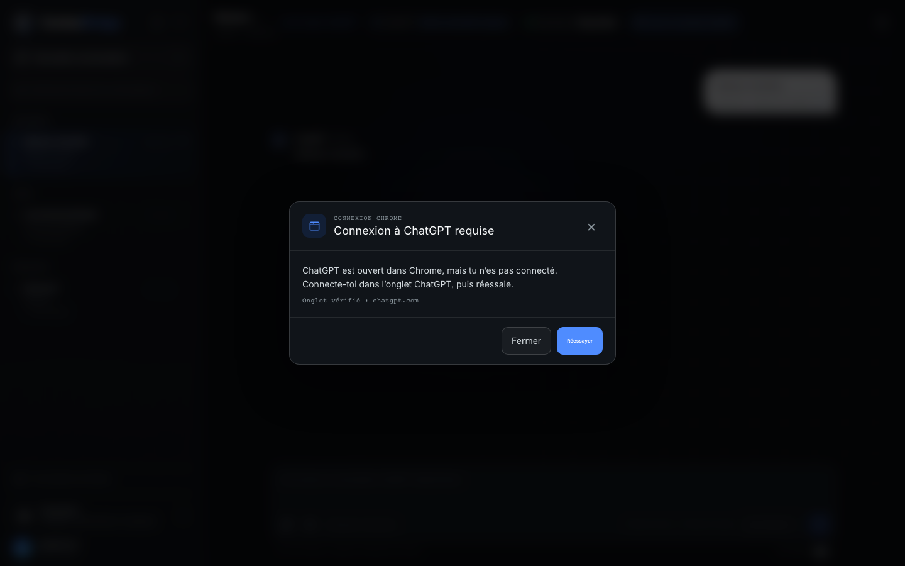

# Cortex Bridge v0.5 user guide

The application interface is French. This guide is in English.

## First launch

1. Complete [installation](../INSTALL.md), including **Load unpacked** from
   `chrome://extensions`.
2. Start Cortex with `./scripts/cortex.sh start`.
3. Open `http://127.0.0.1:8420` in Google Chrome.
4. Press **Ouvrir et connecter ChatGPT** / **Open and connect ChatGPT**.
5. Cortex opens or focuses ChatGPT in the same Chrome window and checks the
   page.
6. If login or verification is required, finish it in the ChatGPT tab and
   press **Réessayer**. **Fermer** only dismisses the dialog.




## Connection states

- **Extension Chrome introuvable**: load or enable the unpacked extension.
- **Connexion à ChatGPT requise**: sign in in the opened ChatGPT tab.
- **Vérification requise**: complete the human check in ChatGPT.
- **ChatGPT est encore en chargement**: keep the tab open and retry.
- **ChatGPT connecté**: the tab is paired and the composer is visible.
- **Onglet ChatGPT fermé**: reopen and connect before continuing.

Cortex never enters credentials, accepts terms, solves CAPTCHA, or falls back
to another browser.

## Conversation navigation

The sidebar loads at most 50 conversations and places each in one exposed
group: **Épinglées**, **Projets**, or **Récentes**. Use **Nouvelle
conversation** at the top. The collapsed rail keeps navigation, new
conversation, expand, and settings.


## Send a message

`Enter` sends the exact draft to ChatGPT; `Shift+Enter` inserts a line. The
optimistic message remains visible while its French state moves through local
queue, sending, visible, waiting, and received. An uncertain delivery is never
resent automatically.


## Execute locally

**Exécuter** opens a preflight rather than sending an execution immediately.
It shows conversation, workspace, executor, capabilities, policy, limits, and
attachments. Write, process, and network start disabled; delete remains
unavailable.


## Two active conversations

Two distinct conversations may write concurrently in two bound ChatGPT tabs
in the same Chrome window. A third remains readable and editable, but send is
rejected until a slot is free. Its draft and staged file remain intact.


## Files and screenshots

The backend validates supported image, PDF, text, data, and Office-container
formats before staging. The Chrome extension v0.5 transfer limit is 25 MiB per
file. ChatGPT may enforce a smaller limit and its visible error wins.

Screenshots capture only the visible bound ChatGPT tab. Show that tab before
capturing; Cortex refuses to capture a different active tab.


## Status, timeout, and information

ChatGPT and local-agent states are independent and adjacent. The activity
drawer remains closed until requested. A conversation switch has one absolute
10-second budget; cached content remains visible and explicit reload is
available after timeout.

Settings > **Info** shows the animated flow from the user through the local
Chrome extension, ChatGPT, preflight, executor, workspace, and evidence.


Reduced-motion users receive a complete static diagram.

## Diagnose and stop

```bash
./scripts/cortex.sh status --json
./scripts/cortex.sh doctor --json
./scripts/cortex.sh logs
./scripts/cortex.sh stop
```

The fallback page is diagnostics-only and cannot send or execute.
