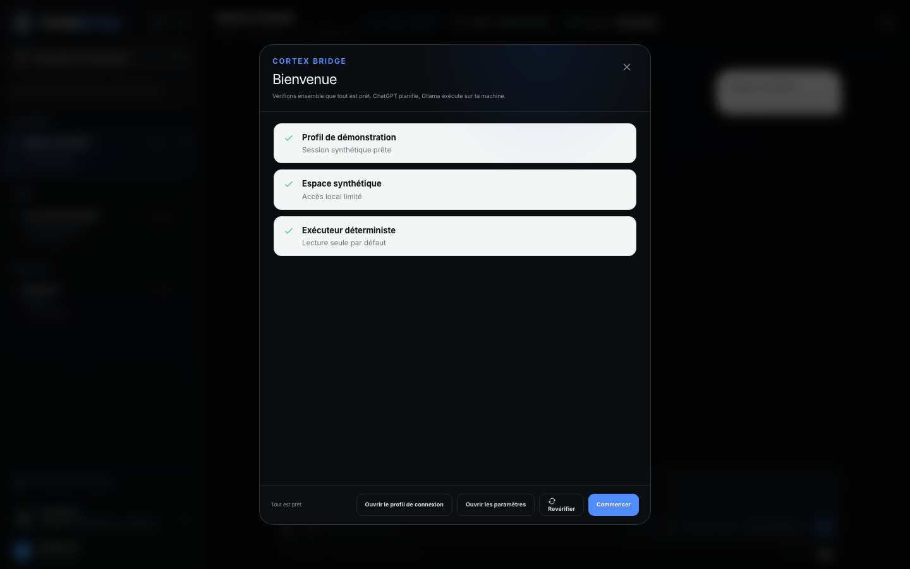
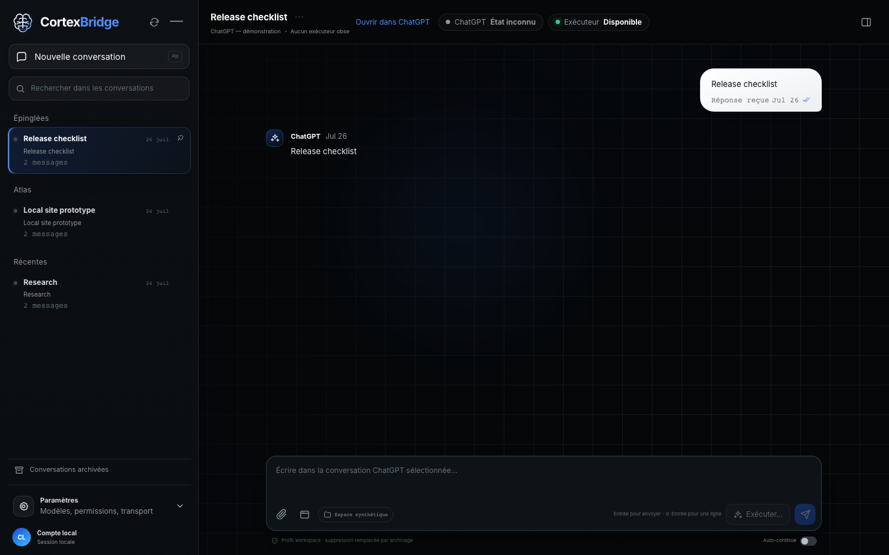
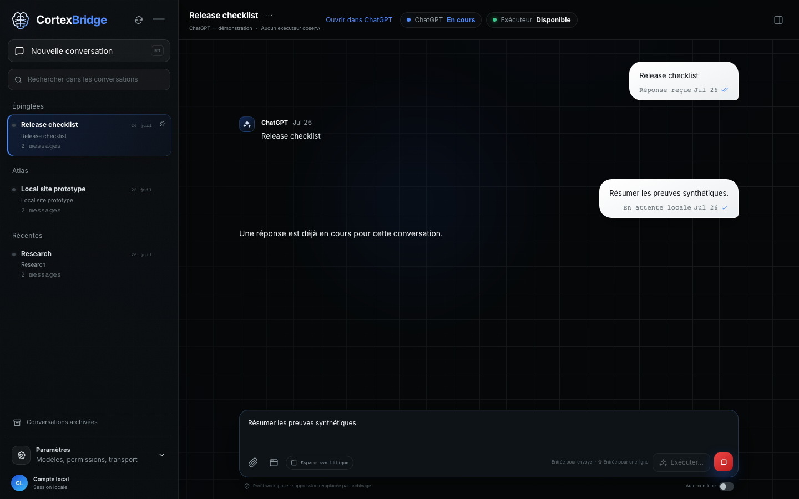
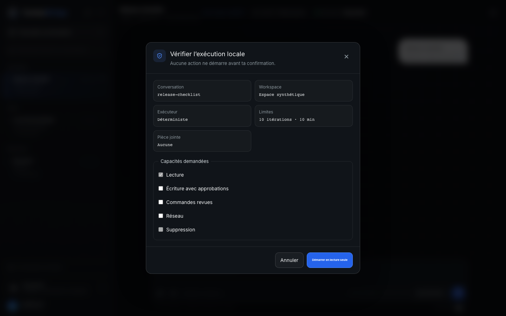
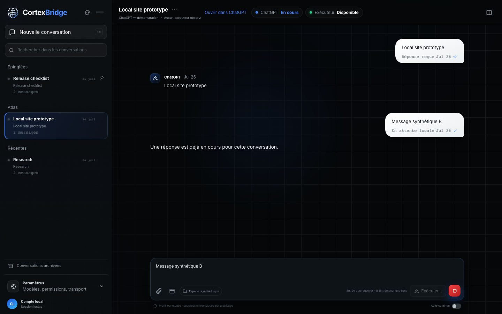
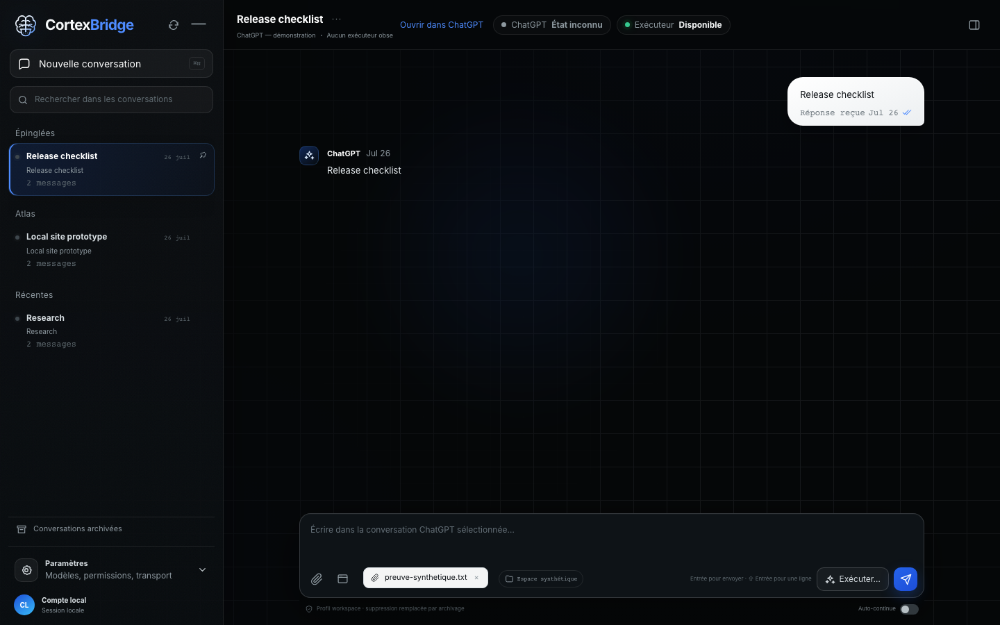
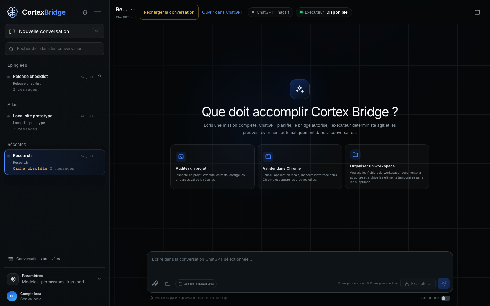

# Cortex Bridge v0.5 user guide

The application interface is French. This guide explains the behavior in English.

## First launch

1. Start Cortex Bridge with `./scripts/cortex.sh start`.
2. Open `http://127.0.0.1:8420`.
3. Open the dedicated Chromium profile from onboarding.
4. Sign in to ChatGPT yourself.
5. Return to Cortex Bridge and refresh conversations.



## Conversation navigation

The left sidebar loads at most 50 conversations and places each conversation in exactly one group:

- **Épinglées** for conversations pinned in ChatGPT;
- **Projets** for conversations with real project metadata;
- **Récentes** for the remaining conversations.

Use **Nouvelle conversation** at the top. The collapsed rail keeps one expand button, new conversation, conversation navigation and settings.



## Send a message

Type in the composer. `Enter` sends the exact draft to ChatGPT. `Shift+Enter` adds a new line.

The optimistic message stays in place while its French status changes:

1. waiting;
2. sending;
3. visible in ChatGPT;
4. waiting for the response;
5. received;
6. uncertain or failed when confirmation is impossible.

An uncertain delivery is never sent again automatically.



## Execute locally

**Exécuter** does not send a mission immediately. It opens a preflight containing:

- conversation;
- workspace;
- executor;
- read, write, process, network and delete capabilities;
- approval policy;
- iteration and time limits;
- attachment tokens.

Write, process and network capabilities start disabled. Delete remains unavailable. Only confirmation creates the local execution.



## Two active conversations

Cortex Bridge supports two distinct active conversation writers. A third conversation can still be opened and edited, but sending is blocked until a slot is free. Its draft and selected file remain in the composer.



## Files and screenshots

Supported files:

- PNG, JPEG, GIF and WebP images, maximum 20 MiB;
- PDF, TXT, JSON, CSV and Markdown;
- DOCX, XLSX and PPTX with validated Office containers;
- maximum 512 MiB for supported non-image files.

Cortex Bridge validates content, not only the filename. Attachments use opaque tokens that expire after 15 minutes. A screenshot must be a regular PNG produced for the selected ChatGPT target.



## Status and pipeline

The header shows ChatGPT transport and executor status independently. The pipeline inspector stays collapsed until requested and remains scoped to the selected conversation.

Unknown information stays unknown. The UI does not invent latency, message counts or connection status.

## Timeout and reload

Conversation selection has one absolute 10-second budget. On timeout, Cortex Bridge preserves the cached conversation as stale and shows **Recharger la conversation**. Reload is explicit and deterministic.



## Information diagram

Settings include an Info section explaining the bridge from the user to the dedicated browser, ChatGPT, execution preflight, deterministic or optional Ollama executor, and scoped results.


Reduced-motion users receive the complete static state without animated movement.

## Stop and diagnose

```bash
./scripts/cortex.sh status --json
./scripts/cortex.sh doctor --json
./scripts/cortex.sh logs
./scripts/cortex.sh stop
```

If the static UI is missing, the fallback page only shows diagnostics and rebuild help. It cannot send a message or start an execution.
